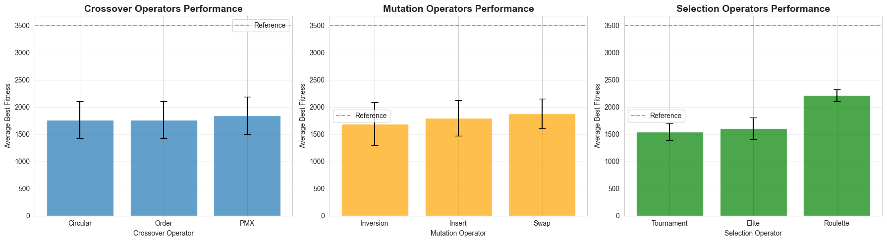
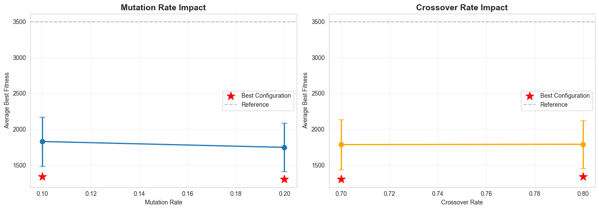
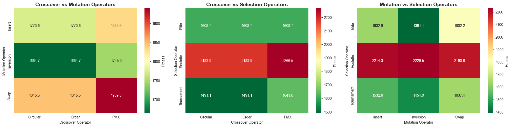
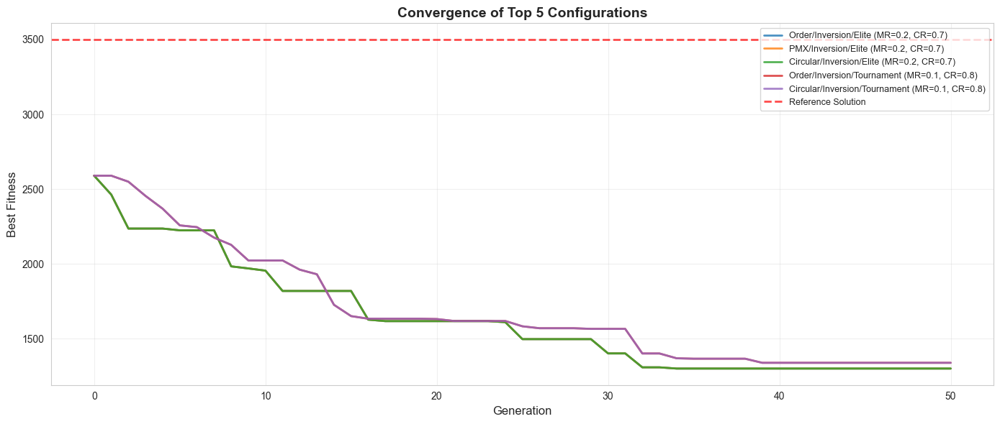
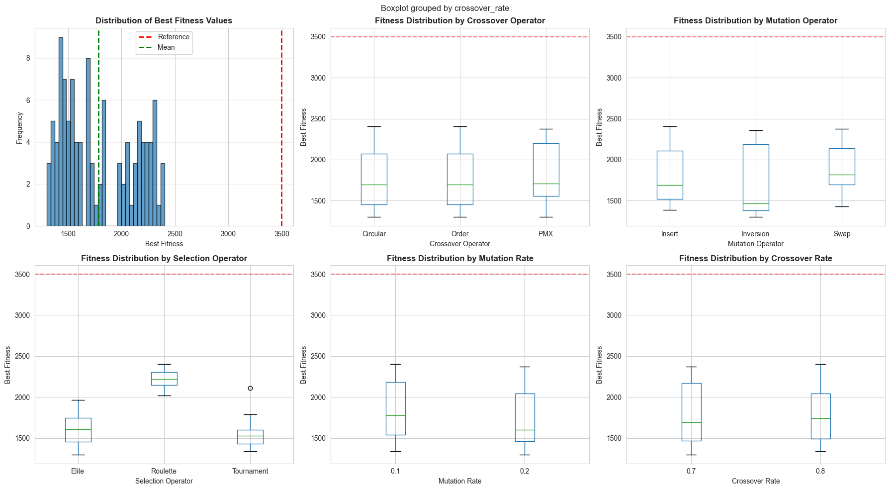
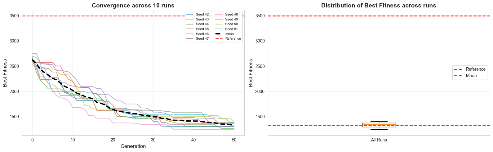

# Evolutionary Algorithms - Exercise 4.2

Setup for permutation-based optimization using Function6


## Setup and Imports


```python
import requests
import numpy as np
from typing import List, Tuple, Callable, Dict, Any
import matplotlib.pyplot as plt
import pandas as pd
import seaborn as sns
from itertools import product
import warnings
warnings.filterwarnings('ignore')

RANDOM_SEED = 42

```


```python
class BlackBox:
    """
    Interface to the black-box service for ODM course.
    """
    def __init__(self, token: int, endpoint: str = 'http://ls-stat-ml.uni-muenster.de:7300/'):
        self.endpoint = endpoint
        self.token = token

    def evaluate(self, objective: str, parameters: list) -> float:
        r = requests.post(url=self.endpoint + "compute/" + objective,
                          json={"parameters": [str(v) for v in parameters], "token": self.token})
        if r.status_code == 200:
            return float(r.json())
        else:
            raise ValueError(r)

```


```python
group_number = 11
bb = BlackBox(token=group_number)

REFERENCE_SOLUTION = list(range(0, 20))
reference_fitness = bb.evaluate("Function6", REFERENCE_SOLUTION)
print(f"Reference solution [0,1,2,...,19] has fitness: {reference_fitness}")

```

    Reference solution [0,1,2,...,19] has fitness: 3498.9338431451583


## Core EA Components


### Population Management


```python
def initialize_population(population_size: int, permutation_length: int = 20) -> List[np.ndarray]:
    """
    Create initial population of random permutations.
    
    Args:
        population_size: Number of individuals in population
        permutation_length: Length of each permutation (default 20 for Function6)
    
    Returns:
        List of numpy arrays, each representing a permutation
    """
    return [np.random.permutation(permutation_length) for _ in range(population_size)]

```


```python
population = initialize_population(population_size=10)
print(f"Created population with {len(population)} individuals")
print(f"Example individual: {population[0]}")

```

    Created population with 10 individuals
    Example individual: [13 14 12  6  1  0  4  9  5  3 19 18  2 11 10 17 15 16  7  8]


### Central Evaluation Function


```python
def evaluate_individual(individual: np.ndarray, blackbox: BlackBox, function_name: str = "Function6") -> float:
    """
    Central evaluation function for a single individual.
    
    Args:
        individual: Permutation to evaluate
        blackbox: BlackBox instance for evaluation
        function_name: Name of the function to evaluate (default: Function6)
    
    Returns:
        Fitness value (lower is better for minimization)
    """
    return blackbox.evaluate(function_name, individual.tolist())


def evaluate_population(population: List[np.ndarray], blackbox: BlackBox, function_name: str = "Function6") -> List[float]:
    """
    Evaluate entire population.
    
    Args:
        population: List of individuals
        blackbox: BlackBox instance for evaluation
        function_name: Name of the function to evaluate
    
    Returns:
        List of fitness values corresponding to each individual
    """
    return [evaluate_individual(ind, blackbox, function_name) for ind in population]

```


```python
fitness_values = evaluate_population(population, bb)
print(f"Fitness values: {fitness_values}")
print(f"Best fitness in population: {min(fitness_values)}")
print(f"Worst fitness in population: {max(fitness_values)}")

```

    Fitness values: [3115.1694640065175, 3069.486026835639, 3223.371286568574, 2722.4178508226396, 3278.1559434460823, 3714.4196656324148, 3002.752640281124, 3542.5543160125853, 2818.3133713317693, 3262.9652024159714]
    Best fitness in population: 2722.4178508226396
    Worst fitness in population: 3714.4196656324148


### Selection Operators


```python
def tournament_selection(population: List[np.ndarray], fitness_values: List[float], tournament_size: int = 3) -> np.ndarray:
    """
    Select individual using tournament selection.
    
    Args:
        population: List of individuals
        fitness_values: Corresponding fitness values
        tournament_size: Number of individuals in tournament
    
    Returns:
        Selected individual
    """
    indices = np.random.choice(len(population), size=tournament_size, replace=False)
    tournament_fitness = [fitness_values[i] for i in indices]
    winner_idx = indices[np.argmin(tournament_fitness)]
    return population[winner_idx].copy()


def elite_selection(population: List[np.ndarray], fitness_values: List[float], **kwargs) -> np.ndarray:
    """
    Select best individual from population (elitist selection).
    
    Args:
        population: List of individuals
        fitness_values: Corresponding fitness values
    
    Returns:
        Best individual
    """
    best_idx = np.argmin(fitness_values)
    return population[best_idx].copy()


def roulette_wheel_selection(population: List[np.ndarray], fitness_values: List[float], **kwargs) -> np.ndarray:
    """
    Select individual using fitness-proportional selection (for minimization).
    
    Args:
        population: List of individuals
        fitness_values: Corresponding fitness values
    
    Returns:
        Selected individual
    """
    inverted_fitness = [1.0 / (1.0 + f) for f in fitness_values]
    probabilities = np.array(inverted_fitness) / sum(inverted_fitness)
    selected_idx = np.random.choice(len(population), p=probabilities)
    return population[selected_idx].copy()

```

### Mutation Operators


```python
def swap_mutation(individual: np.ndarray) -> np.ndarray:
    """
    Swap two random positions in permutation.
    
    Args:
        individual: Permutation to mutate
    
    Returns:
        Mutated permutation
    """
    mutated = individual.copy()
    i, j = np.random.choice(len(mutated), size=2, replace=False)
    mutated[i], mutated[j] = mutated[j], mutated[i]
    return mutated


def insert_mutation(individual: np.ndarray) -> np.ndarray:
    """
    Remove element at one position and insert at another.
    
    Args:
        individual: Permutation to mutate
    
    Returns:
        Mutated permutation
    """
    mutated = individual.copy()
    i, j = np.random.choice(len(mutated), size=2, replace=False)
    element = mutated[i]
    mutated = np.delete(mutated, i)
    mutated = np.insert(mutated, j, element)
    return mutated


def inversion_mutation(individual: np.ndarray) -> np.ndarray:
    """
    Reverse a random segment of the permutation.
    
    Args:
        individual: Permutation to mutate
    
    Returns:
        Mutated permutation
    """
    mutated = individual.copy()
    i, j = sorted(np.random.choice(len(mutated), size=2, replace=False))
    mutated[i:j+1] = mutated[i:j+1][::-1]
    return mutated

```

### Crossover Operators


```python
def order_crossover(parent1: np.ndarray, parent2: np.ndarray) -> Tuple[np.ndarray, np.ndarray]:
    """
    Order crossover (OX) for permutations.
    
    Args:
        parent1: First parent permutation
        parent2: Second parent permutation
    
    Returns:
        Tuple of two offspring
    """
    size = len(parent1)
    i, j = sorted(np.random.choice(size, size=2, replace=False))
    
    offspring1 = np.full(size, -1)
    offspring1[i:j+1] = parent1[i:j+1]
    
    offspring2 = np.full(size, -1)
    offspring2[i:j+1] = parent2[i:j+1]
    
    def fill_offspring(offspring, donor):
        pos = (j + 1) % size
        for gene in np.roll(donor, -j-1):
            if gene not in offspring:
                offspring[pos] = gene
                pos = (pos + 1) % size
        return offspring
    
    offspring1 = fill_offspring(offspring1, parent2)
    offspring2 = fill_offspring(offspring2, parent1)
    
    return offspring1, offspring2


def pmx_crossover(parent1: np.ndarray, parent2: np.ndarray) -> Tuple[np.ndarray, np.ndarray]:
    """
    Partially Mapped Crossover (PMX) for permutations.
    
    Args:
        parent1: First parent permutation
        parent2: Second parent permutation
    
    Returns:
        Tuple of two offspring
    """
    size = len(parent1)
    i, j = sorted(np.random.choice(size, size=2, replace=False))
    
    offspring1 = parent1.copy()
    offspring2 = parent2.copy()
    
    for k in range(i, j+1):
        val1, val2 = offspring1[k], offspring2[k]
        offspring1[k], offspring2[k] = val2, val1
        
        idx1 = np.where(offspring1 == val2)[0]
        idx2 = np.where(offspring2 == val1)[0]
        
        if len(idx1) > 1:
            other_idx = idx1[idx1 != k][0]
            offspring1[other_idx] = val1
            
        if len(idx2) > 1:
            other_idx = idx2[idx2 != k][0]
            offspring2[other_idx] = val2
    
    return offspring1, offspring2

```

### Circular Crossover (for Exercise 4.2)


```python
def circular_crossover(parent1: np.ndarray, parent2: np.ndarray) -> Tuple[np.ndarray, np.ndarray]:
    """
    Circular crossover for permutations.
    
    Selects a random segment from one parent and fills remaining positions
    by iterating circularly through the other parent, only including elements
    not yet present in the offspring.
    
    Args:
        parent1: First parent permutation
        parent2: Second parent permutation
    
    Returns:
        Tuple of two offspring
    """
    size = len(parent1)
    i, j = sorted(np.random.choice(size, size=2, replace=False))
    
    offspring1 = np.full(size, -1)
    offspring2 = np.full(size, -1)
    
    offspring1[i:j+1] = parent1[i:j+1]
    offspring2[i:j+1] = parent2[i:j+1]
    
    def fill_circular(offspring, donor, start_pos):
        used = set(offspring[offspring != -1])
        current_pos = (start_pos + 1) % size
        donor_pos = (start_pos + 1) % size
        
        while -1 in offspring:
            if donor[donor_pos] not in used:
                offspring[current_pos] = donor[donor_pos]
                used.add(donor[donor_pos])
                current_pos = (current_pos + 1) % size
            donor_pos = (donor_pos + 1) % size
        
        return offspring
    
    offspring1 = fill_circular(offspring1, parent2, j)
    offspring2 = fill_circular(offspring2, parent1, j)
    
    return offspring1, offspring2

```

## Evolutionary Algorithm Framework


```python
def evolutionary_algorithm(
    blackbox: BlackBox,
    population_size: int,
    generations: int,
    mutation_rate: float = 0.1,
    crossover_rate: float = 0.8,
    tournament_size: int = 3,
    mutation_operator: Callable = swap_mutation,
    crossover_operator: Callable = order_crossover,
    selection_operator: Callable = tournament_selection,
    permutation_length: int = 20,
    seed: int = None,
    verbose: bool = True
) -> Tuple[np.ndarray, float, List[float]]:
    """
    Generic evolutionary algorithm framework for permutation problems.
    
    Args:
        blackbox: BlackBox instance for evaluation
        population_size: Size of population
        generations: Number of generations to evolve
        mutation_rate: Probability of mutation
        crossover_rate: Probability of crossover
        tournament_size: Size for tournament selection
        mutation_operator: Function for mutation
        crossover_operator: Function for crossover
        selection_operator: Function for selection
        permutation_length: Length of permutations
        seed: Random seed for reproducibility
        verbose: Print progress information
    
    Returns:
        Tuple of (best_individual, best_fitness, fitness_history)
    """
    if seed is not None:
        np.random.seed(seed)
    
    population = initialize_population(population_size, permutation_length)
    fitness_values = evaluate_population(population, blackbox)
    
    best_idx = np.argmin(fitness_values)
    best_individual = population[best_idx].copy()
    best_fitness = fitness_values[best_idx]
    
    fitness_history = [best_fitness]
    
    for generation in range(generations):
        new_population = []
        
        while len(new_population) < population_size:
            if np.random.random() < crossover_rate:
                parent1 = selection_operator(population, fitness_values, tournament_size=tournament_size)
                parent2 = selection_operator(population, fitness_values, tournament_size=tournament_size)
                
                offspring1, offspring2 = crossover_operator(parent1, parent2)
                new_population.extend([offspring1, offspring2])
            else:
                parent = selection_operator(population, fitness_values, tournament_size=tournament_size)
                new_population.append(parent)
        
        new_population = new_population[:population_size]
        
        for i in range(len(new_population)):
            if np.random.random() < mutation_rate:
                new_population[i] = mutation_operator(new_population[i])
        
        population = new_population
        fitness_values = evaluate_population(population, blackbox)
        
        current_best_idx = np.argmin(fitness_values)
        current_best_fitness = fitness_values[current_best_idx]
        
        if current_best_fitness < best_fitness:
            best_fitness = current_best_fitness
            best_individual = population[current_best_idx].copy()
        
        fitness_history.append(best_fitness)
        
        if verbose and (generation + 1) % 10 == 0:
            avg_fitness = np.mean(fitness_values)
            print(f"Generation {generation + 1}/{generations}: Best={best_fitness:.4f}, Avg={avg_fitness:.4f}")
    
    return best_individual, best_fitness, fitness_history

```

## Comprehensive Grid Search Experiments

Systematic evaluation of all operator combinations and hyperparameters
.8


```python
POPULATION_SIZE = 30
GENERATIONS = 50

CROSSOVER_OPERATORS = {
    "Order": order_crossover,
    "PMX": pmx_crossover,
    "Circular": circular_crossover,
}

MUTATION_OPERATORS = {
    "Swap": swap_mutation,
    "Insert": insert_mutation,
    "Inversion": inversion_mutation,
}

SELECTION_OPERATORS = {
    "Tournament": tournament_selection,
    "Roulette": roulette_wheel_selection,
    "Elite": elite_selection,
}

MUTATION_RATES = [0.1, 0.2]
CROSSOVER_RATES = [0.7, 0.8]

print(f"Experiment Configuration:")
print(f"  Population Size: {POPULATION_SIZE}")
print(f"  Generations: {GENERATIONS}")
print(f"  Random Seed: {RANDOM_SEED}")
print(f"\nOperators to test:")
print(f"  Crossover: {list(CROSSOVER_OPERATORS.keys())}")
print(f"  Mutation: {list(MUTATION_OPERATORS.keys())}")
print(f"  Selection: {list(SELECTION_OPERATORS.keys())}")
print(f"\nHyperparameters to test:")
print(f"  Mutation Rates: {MUTATION_RATES}")
print(f"  Crossover Rates: {CROSSOVER_RATES}")
print(f"\nTotal experiments: {len(CROSSOVER_OPERATORS) * len(MUTATION_OPERATORS) * len(SELECTION_OPERATORS) * len(MUTATION_RATES) * len(CROSSOVER_RATES)}")
print(f"\nEstimated runtime: ~{len(CROSSOVER_OPERATORS) * len(MUTATION_OPERATORS) * len(SELECTION_OPERATORS) * len(MUTATION_RATES) * len(CROSSOVER_RATES) * 2:.0f} minutes (~{len(CROSSOVER_OPERATORS) * len(MUTATION_OPERATORS) * len(SELECTION_OPERATORS) * len(MUTATION_RATES) * len(CROSSOVER_RATES) * 2 / 60:.1f} hours)")

```

    Experiment Configuration:
      Population Size: 30
      Generations: 50
      Random Seed: 42
    
    Operators to test:
      Crossover: ['Order', 'PMX', 'Circular']
      Mutation: ['Swap', 'Insert', 'Inversion']
      Selection: ['Tournament', 'Roulette', 'Elite']
    
    Hyperparameters to test:
      Mutation Rates: [0.1, 0.2]
      Crossover Rates: [0.7, 0.8]
    
    Total experiments: 108
    
    Estimated runtime: ~216 minutes (~3.6 hours)


```python
def run_grid_search(
    blackbox: BlackBox,
    crossover_operators: Dict[str, Callable],
    mutation_operators: Dict[str, Callable],
    selection_operators: Dict[str, Callable],
    mutation_rates: List[float],
    crossover_rates: List[float],
    population_size: int,
    generations: int,
    seed: int = RANDOM_SEED,
    verbose: bool = False
) -> pd.DataFrame:
    """
    Run complete grid search over all operator and hyperparameter combinations.
    
    Args:
        blackbox: BlackBox instance for evaluation
        crossover_operators: Dictionary of crossover operators
        mutation_operators: Dictionary of mutation operators
        selection_operators: Dictionary of selection operators
        mutation_rates: List of mutation rates to test
        crossover_rates: List of crossover rates to test
        population_size: Population size (fixed)
        generations: Number of generations (fixed)
        seed: Random seed for reproducibility
        verbose: Print progress information
    
    Returns:
        DataFrame with all experiment results
    """
    results = []
    total_experiments = (len(crossover_operators) * len(mutation_operators) * 
                        len(selection_operators) * len(mutation_rates) * len(crossover_rates))
    experiment_num = 0
    
    for (cross_name, cross_op), (mut_name, mut_op), (sel_name, sel_op), mut_rate, cross_rate in product(
        crossover_operators.items(),
        mutation_operators.items(),
        selection_operators.items(),
        mutation_rates,
        crossover_rates
    ):
        experiment_num += 1
        
        if verbose or experiment_num % 10 == 0:
            print(f"Running experiment {experiment_num}/{total_experiments}: "
                  f"Cross={cross_name}, Mut={mut_name}, Sel={sel_name}, "
                  f"MR={mut_rate}, CR={cross_rate}")
        
        best_ind, best_fit, history = evolutionary_algorithm(
            blackbox=blackbox,
            population_size=population_size,
            generations=generations,
            mutation_rate=mut_rate,
            crossover_rate=cross_rate,
            mutation_operator=mut_op,
            crossover_operator=cross_op,
            selection_operator=sel_op,
            seed=seed,
            verbose=False
        )
        
        results.append({
            'crossover': cross_name,
            'mutation': mut_name,
            'selection': sel_name,
            'mutation_rate': mut_rate,
            'crossover_rate': cross_rate,
            'best_fitness': best_fit,
            'final_fitness': history[-1],
            'improvement': reference_fitness - best_fit,
            'history': history,
            'best_solution': best_ind
        })
    
    return pd.DataFrame(results)

print("\nRunning comprehensive grid search...")
print("This may take a while...")

results_df = run_grid_search(
    blackbox=bb,
    crossover_operators=CROSSOVER_OPERATORS,
    mutation_operators=MUTATION_OPERATORS,
    selection_operators=SELECTION_OPERATORS,
    mutation_rates=MUTATION_RATES,
    crossover_rates=CROSSOVER_RATES,
    population_size=POPULATION_SIZE,
    generations=GENERATIONS,
    seed=RANDOM_SEED,
    verbose=True
)

print(f"\n{'='*60}")
print("Grid search completed!")
print(f"Total experiments run: {len(results_df)}")
print(f"{'='*60}")

```

    
    Running comprehensive grid search...
    This may take a while...
    Running experiment 1/108: Cross=Order, Mut=Swap, Sel=Tournament, MR=0.1, CR=0.7
    Running experiment 2/108: Cross=Order, Mut=Swap, Sel=Tournament, MR=0.1, CR=0.8
    Running experiment 3/108: Cross=Order, Mut=Swap, Sel=Tournament, MR=0.2, CR=0.7
    Running experiment 4/108: Cross=Order, Mut=Swap, Sel=Tournament, MR=0.2, CR=0.8
    Running experiment 5/108: Cross=Order, Mut=Swap, Sel=Roulette, MR=0.1, CR=0.7
    Running experiment 6/108: Cross=Order, Mut=Swap, Sel=Roulette, MR=0.1, CR=0.8
    Running experiment 7/108: Cross=Order, Mut=Swap, Sel=Roulette, MR=0.2, CR=0.7
    Running experiment 8/108: Cross=Order, Mut=Swap, Sel=Roulette, MR=0.2, CR=0.8
    Running experiment 9/108: Cross=Order, Mut=Swap, Sel=Elite, MR=0.1, CR=0.7
    Running experiment 10/108: Cross=Order, Mut=Swap, Sel=Elite, MR=0.1, CR=0.8
    Running experiment 11/108: Cross=Order, Mut=Swap, Sel=Elite, MR=0.2, CR=0.7
    Running experiment 12/108: Cross=Order, Mut=Swap, Sel=Elite, MR=0.2, CR=0.8
    Running experiment 13/108: Cross=Order, Mut=Insert, Sel=Tournament, MR=0.1, CR=0.7
    Running experiment 14/108: Cross=Order, Mut=Insert, Sel=Tournament, MR=0.1, CR=0.8
    Running experiment 15/108: Cross=Order, Mut=Insert, Sel=Tournament, MR=0.2, CR=0.7
    Running experiment 16/108: Cross=Order, Mut=Insert, Sel=Tournament, MR=0.2, CR=0.8
    Running experiment 17/108: Cross=Order, Mut=Insert, Sel=Roulette, MR=0.1, CR=0.7
    Running experiment 18/108: Cross=Order, Mut=Insert, Sel=Roulette, MR=0.1, CR=0.8
    Running experiment 19/108: Cross=Order, Mut=Insert, Sel=Roulette, MR=0.2, CR=0.7
    Running experiment 20/108: Cross=Order, Mut=Insert, Sel=Roulette, MR=0.2, CR=0.8
    Running experiment 21/108: Cross=Order, Mut=Insert, Sel=Elite, MR=0.1, CR=0.7
    Running experiment 22/108: Cross=Order, Mut=Insert, Sel=Elite, MR=0.1, CR=0.8
    Running experiment 23/108: Cross=Order, Mut=Insert, Sel=Elite, MR=0.2, CR=0.7
    Running experiment 24/108: Cross=Order, Mut=Insert, Sel=Elite, MR=0.2, CR=0.8
    Running experiment 25/108: Cross=Order, Mut=Inversion, Sel=Tournament, MR=0.1, CR=0.7
    Running experiment 26/108: Cross=Order, Mut=Inversion, Sel=Tournament, MR=0.1, CR=0.8
    Running experiment 27/108: Cross=Order, Mut=Inversion, Sel=Tournament, MR=0.2, CR=0.7
    Running experiment 28/108: Cross=Order, Mut=Inversion, Sel=Tournament, MR=0.2, CR=0.8
    Running experiment 29/108: Cross=Order, Mut=Inversion, Sel=Roulette, MR=0.1, CR=0.7
    Running experiment 30/108: Cross=Order, Mut=Inversion, Sel=Roulette, MR=0.1, CR=0.8
    Running experiment 31/108: Cross=Order, Mut=Inversion, Sel=Roulette, MR=0.2, CR=0.7
    Running experiment 32/108: Cross=Order, Mut=Inversion, Sel=Roulette, MR=0.2, CR=0.8
    Running experiment 33/108: Cross=Order, Mut=Inversion, Sel=Elite, MR=0.1, CR=0.7
    Running experiment 34/108: Cross=Order, Mut=Inversion, Sel=Elite, MR=0.1, CR=0.8
    Running experiment 35/108: Cross=Order, Mut=Inversion, Sel=Elite, MR=0.2, CR=0.7
    Running experiment 36/108: Cross=Order, Mut=Inversion, Sel=Elite, MR=0.2, CR=0.8
    Running experiment 37/108: Cross=PMX, Mut=Swap, Sel=Tournament, MR=0.1, CR=0.7
    Running experiment 38/108: Cross=PMX, Mut=Swap, Sel=Tournament, MR=0.1, CR=0.8
    Running experiment 39/108: Cross=PMX, Mut=Swap, Sel=Tournament, MR=0.2, CR=0.7
    Running experiment 40/108: Cross=PMX, Mut=Swap, Sel=Tournament, MR=0.2, CR=0.8
    Running experiment 41/108: Cross=PMX, Mut=Swap, Sel=Roulette, MR=0.1, CR=0.7
    Running experiment 42/108: Cross=PMX, Mut=Swap, Sel=Roulette, MR=0.1, CR=0.8
    Running experiment 43/108: Cross=PMX, Mut=Swap, Sel=Roulette, MR=0.2, CR=0.7
    Running experiment 44/108: Cross=PMX, Mut=Swap, Sel=Roulette, MR=0.2, CR=0.8
    Running experiment 45/108: Cross=PMX, Mut=Swap, Sel=Elite, MR=0.1, CR=0.7
    Running experiment 46/108: Cross=PMX, Mut=Swap, Sel=Elite, MR=0.1, CR=0.8
    Running experiment 47/108: Cross=PMX, Mut=Swap, Sel=Elite, MR=0.2, CR=0.7
    Running experiment 48/108: Cross=PMX, Mut=Swap, Sel=Elite, MR=0.2, CR=0.8
    Running experiment 49/108: Cross=PMX, Mut=Insert, Sel=Tournament, MR=0.1, CR=0.7
    Running experiment 50/108: Cross=PMX, Mut=Insert, Sel=Tournament, MR=0.1, CR=0.8
    Running experiment 51/108: Cross=PMX, Mut=Insert, Sel=Tournament, MR=0.2, CR=0.7
    Running experiment 52/108: Cross=PMX, Mut=Insert, Sel=Tournament, MR=0.2, CR=0.8
    Running experiment 53/108: Cross=PMX, Mut=Insert, Sel=Roulette, MR=0.1, CR=0.7
    Running experiment 54/108: Cross=PMX, Mut=Insert, Sel=Roulette, MR=0.1, CR=0.8
    Running experiment 55/108: Cross=PMX, Mut=Insert, Sel=Roulette, MR=0.2, CR=0.7
    Running experiment 56/108: Cross=PMX, Mut=Insert, Sel=Roulette, MR=0.2, CR=0.8
    Running experiment 57/108: Cross=PMX, Mut=Insert, Sel=Elite, MR=0.1, CR=0.7
    Running experiment 58/108: Cross=PMX, Mut=Insert, Sel=Elite, MR=0.1, CR=0.8
    Running experiment 59/108: Cross=PMX, Mut=Insert, Sel=Elite, MR=0.2, CR=0.7
    Running experiment 60/108: Cross=PMX, Mut=Insert, Sel=Elite, MR=0.2, CR=0.8
    Running experiment 61/108: Cross=PMX, Mut=Inversion, Sel=Tournament, MR=0.1, CR=0.7
    Running experiment 62/108: Cross=PMX, Mut=Inversion, Sel=Tournament, MR=0.1, CR=0.8
    Running experiment 63/108: Cross=PMX, Mut=Inversion, Sel=Tournament, MR=0.2, CR=0.7
    Running experiment 64/108: Cross=PMX, Mut=Inversion, Sel=Tournament, MR=0.2, CR=0.8
    Running experiment 65/108: Cross=PMX, Mut=Inversion, Sel=Roulette, MR=0.1, CR=0.7
    Running experiment 66/108: Cross=PMX, Mut=Inversion, Sel=Roulette, MR=0.1, CR=0.8
    Running experiment 67/108: Cross=PMX, Mut=Inversion, Sel=Roulette, MR=0.2, CR=0.7
    Running experiment 68/108: Cross=PMX, Mut=Inversion, Sel=Roulette, MR=0.2, CR=0.8
    Running experiment 69/108: Cross=PMX, Mut=Inversion, Sel=Elite, MR=0.1, CR=0.7
    Running experiment 70/108: Cross=PMX, Mut=Inversion, Sel=Elite, MR=0.1, CR=0.8
    Running experiment 71/108: Cross=PMX, Mut=Inversion, Sel=Elite, MR=0.2, CR=0.7
    Running experiment 72/108: Cross=PMX, Mut=Inversion, Sel=Elite, MR=0.2, CR=0.8
    Running experiment 73/108: Cross=Circular, Mut=Swap, Sel=Tournament, MR=0.1, CR=0.7
    Running experiment 74/108: Cross=Circular, Mut=Swap, Sel=Tournament, MR=0.1, CR=0.8
    Running experiment 75/108: Cross=Circular, Mut=Swap, Sel=Tournament, MR=0.2, CR=0.7
    Running experiment 76/108: Cross=Circular, Mut=Swap, Sel=Tournament, MR=0.2, CR=0.8
    Running experiment 77/108: Cross=Circular, Mut=Swap, Sel=Roulette, MR=0.1, CR=0.7
    Running experiment 78/108: Cross=Circular, Mut=Swap, Sel=Roulette, MR=0.1, CR=0.8
    Running experiment 79/108: Cross=Circular, Mut=Swap, Sel=Roulette, MR=0.2, CR=0.7
    Running experiment 80/108: Cross=Circular, Mut=Swap, Sel=Roulette, MR=0.2, CR=0.8
    Running experiment 81/108: Cross=Circular, Mut=Swap, Sel=Elite, MR=0.1, CR=0.7
    Running experiment 82/108: Cross=Circular, Mut=Swap, Sel=Elite, MR=0.1, CR=0.8
    Running experiment 83/108: Cross=Circular, Mut=Swap, Sel=Elite, MR=0.2, CR=0.7
    Running experiment 84/108: Cross=Circular, Mut=Swap, Sel=Elite, MR=0.2, CR=0.8
    Running experiment 85/108: Cross=Circular, Mut=Insert, Sel=Tournament, MR=0.1, CR=0.7
    Running experiment 86/108: Cross=Circular, Mut=Insert, Sel=Tournament, MR=0.1, CR=0.8
    Running experiment 87/108: Cross=Circular, Mut=Insert, Sel=Tournament, MR=0.2, CR=0.7
    Running experiment 88/108: Cross=Circular, Mut=Insert, Sel=Tournament, MR=0.2, CR=0.8
    Running experiment 89/108: Cross=Circular, Mut=Insert, Sel=Roulette, MR=0.1, CR=0.7
    Running experiment 90/108: Cross=Circular, Mut=Insert, Sel=Roulette, MR=0.1, CR=0.8
    Running experiment 91/108: Cross=Circular, Mut=Insert, Sel=Roulette, MR=0.2, CR=0.7
    Running experiment 92/108: Cross=Circular, Mut=Insert, Sel=Roulette, MR=0.2, CR=0.8
    Running experiment 93/108: Cross=Circular, Mut=Insert, Sel=Elite, MR=0.1, CR=0.7
    Running experiment 94/108: Cross=Circular, Mut=Insert, Sel=Elite, MR=0.1, CR=0.8
    Running experiment 95/108: Cross=Circular, Mut=Insert, Sel=Elite, MR=0.2, CR=0.7
    Running experiment 96/108: Cross=Circular, Mut=Insert, Sel=Elite, MR=0.2, CR=0.8
    Running experiment 97/108: Cross=Circular, Mut=Inversion, Sel=Tournament, MR=0.1, CR=0.7
    Running experiment 98/108: Cross=Circular, Mut=Inversion, Sel=Tournament, MR=0.1, CR=0.8
    Running experiment 99/108: Cross=Circular, Mut=Inversion, Sel=Tournament, MR=0.2, CR=0.7
    Running experiment 100/108: Cross=Circular, Mut=Inversion, Sel=Tournament, MR=0.2, CR=0.8
    Running experiment 101/108: Cross=Circular, Mut=Inversion, Sel=Roulette, MR=0.1, CR=0.7
    Running experiment 102/108: Cross=Circular, Mut=Inversion, Sel=Roulette, MR=0.1, CR=0.8
    Running experiment 103/108: Cross=Circular, Mut=Inversion, Sel=Roulette, MR=0.2, CR=0.7
    Running experiment 104/108: Cross=Circular, Mut=Inversion, Sel=Roulette, MR=0.2, CR=0.8
    Running experiment 105/108: Cross=Circular, Mut=Inversion, Sel=Elite, MR=0.1, CR=0.7
    Running experiment 106/108: Cross=Circular, Mut=Inversion, Sel=Elite, MR=0.1, CR=0.8
    Running experiment 107/108: Cross=Circular, Mut=Inversion, Sel=Elite, MR=0.2, CR=0.7
    Running experiment 108/108: Cross=Circular, Mut=Inversion, Sel=Elite, MR=0.2, CR=0.8
    
    ============================================================
    Grid search completed!
    Total experiments run: 108
    ============================================================


## Analysis and Visualization

Comprehensive analysis of the grid search results


```python
### Best Results Summary

```


```python
top_10 = results_df.nsmallest(10, 'best_fitness')

print("="*80)
print("TOP 10 BEST CONFIGURATIONS")
print("="*80)
print(f"\nReference Fitness: {reference_fitness:.4f}\n")

for idx, (i, row) in enumerate(top_10.iterrows(), 1):
    print(f"{idx}. Fitness: {row['best_fitness']:.4f} (Improvement: {row['improvement']:.4f})")
    print(f"   Crossover: {row['crossover']}, Mutation: {row['mutation']}, Selection: {row['selection']}")
    print(f"   Mutation Rate: {row['mutation_rate']}, Crossover Rate: {row['crossover_rate']}")
    print()

best_config = top_10.iloc[0]
print("="*80)
print("BEST OVERALL CONFIGURATION:")
print("="*80)
print(f"Fitness: {best_config['best_fitness']:.4f}")
print(f"Improvement over reference: {best_config['improvement']:.4f}")
print(f"Crossover Operator: {best_config['crossover']}")
print(f"Mutation Operator: {best_config['mutation']}")
print(f"Selection Operator: {best_config['selection']}")
print(f"Mutation Rate: {best_config['mutation_rate']}")
print(f"Crossover Rate: {best_config['crossover_rate']}")
print(f"Best Solution: {best_config['best_solution']}")
print("="*80)

```

    ================================================================================
    TOP 10 BEST CONFIGURATIONS
    ================================================================================
    
    Reference Fitness: 3498.9338
    
    1. Fitness: 1300.7856 (Improvement: 2198.1482)
       Crossover: Order, Mutation: Inversion, Selection: Elite
       Mutation Rate: 0.2, Crossover Rate: 0.7
    
    2. Fitness: 1300.7856 (Improvement: 2198.1482)
       Crossover: PMX, Mutation: Inversion, Selection: Elite
       Mutation Rate: 0.2, Crossover Rate: 0.7
    
    3. Fitness: 1300.7856 (Improvement: 2198.1482)
       Crossover: Circular, Mutation: Inversion, Selection: Elite
       Mutation Rate: 0.2, Crossover Rate: 0.7
    
    4. Fitness: 1339.2199 (Improvement: 2159.7140)
       Crossover: Order, Mutation: Inversion, Selection: Tournament
       Mutation Rate: 0.1, Crossover Rate: 0.8
    
    5. Fitness: 1339.2199 (Improvement: 2159.7140)
       Crossover: Circular, Mutation: Inversion, Selection: Tournament
       Mutation Rate: 0.1, Crossover Rate: 0.8
    
    6. Fitness: 1365.8659 (Improvement: 2133.0680)
       Crossover: Order, Mutation: Inversion, Selection: Elite
       Mutation Rate: 0.1, Crossover Rate: 0.8
    
    7. Fitness: 1365.8659 (Improvement: 2133.0680)
       Crossover: PMX, Mutation: Inversion, Selection: Elite
       Mutation Rate: 0.1, Crossover Rate: 0.8
    
    8. Fitness: 1365.8659 (Improvement: 2133.0680)
       Crossover: Circular, Mutation: Inversion, Selection: Elite
       Mutation Rate: 0.1, Crossover Rate: 0.8
    
    9. Fitness: 1380.6315 (Improvement: 2118.3023)
       Crossover: Order, Mutation: Inversion, Selection: Tournament
       Mutation Rate: 0.1, Crossover Rate: 0.7
    
    10. Fitness: 1380.6315 (Improvement: 2118.3023)
       Crossover: Circular, Mutation: Inversion, Selection: Tournament
       Mutation Rate: 0.1, Crossover Rate: 0.7
    
    ================================================================================
    BEST OVERALL CONFIGURATION:
    ================================================================================
    Fitness: 1300.7856
    Improvement over reference: 2198.1482
    Crossover Operator: Order
    Mutation Operator: Inversion
    Selection Operator: Elite
    Mutation Rate: 0.2
    Crossover Rate: 0.7
    Best Solution: [ 5 16  8 13 11  7  2 18 10  6 14 15  9 19  1 17  4 12  0  3]
    ================================================================================


### 1. Operator Comparison


```python
fig, axes = plt.subplots(1, 3, figsize=(18, 5))

crossover_perf = results_df.groupby('crossover')['best_fitness'].agg(['mean', 'std', 'min'])
crossover_perf = crossover_perf.sort_values('mean')
axes[0].bar(crossover_perf.index, crossover_perf['mean'], yerr=crossover_perf['std'], capsize=5, alpha=0.7)
axes[0].axhline(y=reference_fitness, color='r', linestyle='--', label='Reference', alpha=0.5)
axes[0].set_title('Crossover Operators Performance', fontsize=14, fontweight='bold')
axes[0].set_ylabel('Average Best Fitness')
axes[0].set_xlabel('Crossover Operator')
axes[0].legend()
axes[0].grid(axis='y', alpha=0.3)

mutation_perf = results_df.groupby('mutation')['best_fitness'].agg(['mean', 'std', 'min'])
mutation_perf = mutation_perf.sort_values('mean')
axes[1].bar(mutation_perf.index, mutation_perf['mean'], yerr=mutation_perf['std'], capsize=5, alpha=0.7, color='orange')
axes[1].axhline(y=reference_fitness, color='r', linestyle='--', label='Reference', alpha=0.5)
axes[1].set_title('Mutation Operators Performance', fontsize=14, fontweight='bold')
axes[1].set_ylabel('Average Best Fitness')
axes[1].set_xlabel('Mutation Operator')
axes[1].legend()
axes[1].grid(axis='y', alpha=0.3)

selection_perf = results_df.groupby('selection')['best_fitness'].agg(['mean', 'std', 'min'])
selection_perf = selection_perf.sort_values('mean')
axes[2].bar(selection_perf.index, selection_perf['mean'], yerr=selection_perf['std'], capsize=5, alpha=0.7, color='green')
axes[2].axhline(y=reference_fitness, color='r', linestyle='--', label='Reference', alpha=0.5)
axes[2].set_title('Selection Operators Performance', fontsize=14, fontweight='bold')
axes[2].set_ylabel('Average Best Fitness')
axes[2].set_xlabel('Selection Operator')
axes[2].legend()
axes[2].grid(axis='y', alpha=0.3)

plt.tight_layout()
plt.show()

print("\nOperator Performance Summary:")
print("\nCrossover Operators (lower is better):")
print(crossover_perf)
print("\nMutation Operators (lower is better):")
print(mutation_perf)
print("\nSelection Operators (lower is better):")
print(selection_perf)

```


    

    


    
    Operator Performance Summary:
    
    Crossover Operators (lower is better):
                      mean         std          min
    crossover                                      
    Circular   1761.254020  341.554077  1300.785646
    Order      1761.254020  341.554077  1300.785646
    PMX        1839.022612  344.819142  1300.785646
    
    Mutation Operators (lower is better):
                      mean         std          min
    mutation                                       
    Inversion  1691.530032  396.640903  1300.785646
    Insert     1793.280987  327.590227  1386.636753
    Swap       1876.719634  272.087135  1432.516494
    
    Selection Operators (lower is better):
                       mean         std          min
    selection                                       
    Tournament  1541.355922  154.700484  1339.219886
    Elite       1608.710405  200.751438  1300.785646
    Roulette    2211.464326  109.792521  2017.758534


### 2. Hyperparameter Analysis


```python
fig, axes = plt.subplots(1, 2, figsize=(14, 5))

mutation_rate_perf = results_df.groupby('mutation_rate')['best_fitness'].agg(['mean', 'std', 'min'])
axes[0].errorbar(mutation_rate_perf.index, mutation_rate_perf['mean'], 
                 yerr=mutation_rate_perf['std'], marker='o', capsize=5, linewidth=2, markersize=8)
axes[0].scatter(mutation_rate_perf.index, mutation_rate_perf['min'], color='red', 
                marker='*', s=200, label='Best Configuration', zorder=5)
axes[0].axhline(y=reference_fitness, color='gray', linestyle='--', label='Reference', alpha=0.5)
axes[0].set_title('Mutation Rate Impact', fontsize=14, fontweight='bold')
axes[0].set_ylabel('Average Best Fitness')
axes[0].set_xlabel('Mutation Rate')
axes[0].legend()
axes[0].grid(True, alpha=0.3)

crossover_rate_perf = results_df.groupby('crossover_rate')['best_fitness'].agg(['mean', 'std', 'min'])
axes[1].errorbar(crossover_rate_perf.index, crossover_rate_perf['mean'], 
                 yerr=crossover_rate_perf['std'], marker='o', capsize=5, linewidth=2, markersize=8, color='orange')
axes[1].scatter(crossover_rate_perf.index, crossover_rate_perf['min'], color='red', 
                marker='*', s=200, label='Best Configuration', zorder=5)
axes[1].axhline(y=reference_fitness, color='gray', linestyle='--', label='Reference', alpha=0.5)
axes[1].set_title('Crossover Rate Impact', fontsize=14, fontweight='bold')
axes[1].set_ylabel('Average Best Fitness')
axes[1].set_xlabel('Crossover Rate')
axes[1].legend()
axes[1].grid(True, alpha=0.3)

plt.tight_layout()
plt.show()

print("\nHyperparameter Performance Summary:")
print("\nMutation Rates (lower is better):")
print(mutation_rate_perf)
print("\nCrossover Rates (lower is better):")
print(crossover_rate_perf)

```


    

    


    
    Hyperparameter Performance Summary:
    
    Mutation Rates (lower is better):
                          mean         std          min
    mutation_rate                                      
    0.1            1828.025427  343.263354  1339.219886
    0.2            1746.328341  337.795785  1300.785646
    
    Crossover Rates (lower is better):
                           mean         std          min
    crossover_rate                                      
    0.7             1784.761612  350.499288  1300.785646
    0.8             1789.592156  335.371819  1339.219886


### 3. Heatmap Analysis - Operator Interactions


```python
fig, axes = plt.subplots(1, 3, figsize=(20, 5))

crossover_mutation = results_df.pivot_table(
    values='best_fitness', index='mutation', columns='crossover', aggfunc='mean'
)
sns.heatmap(crossover_mutation, annot=True, fmt='.1f', cmap='RdYlGn_r', ax=axes[0], cbar_kws={'label': 'Fitness'})
axes[0].set_title('Crossover vs Mutation Operators', fontsize=14, fontweight='bold')
axes[0].set_xlabel('Crossover Operator')
axes[0].set_ylabel('Mutation Operator')

crossover_selection = results_df.pivot_table(
    values='best_fitness', index='selection', columns='crossover', aggfunc='mean'
)
sns.heatmap(crossover_selection, annot=True, fmt='.1f', cmap='RdYlGn_r', ax=axes[1], cbar_kws={'label': 'Fitness'})
axes[1].set_title('Crossover vs Selection Operators', fontsize=14, fontweight='bold')
axes[1].set_xlabel('Crossover Operator')
axes[1].set_ylabel('Selection Operator')

mutation_selection = results_df.pivot_table(
    values='best_fitness', index='selection', columns='mutation', aggfunc='mean'
)
sns.heatmap(mutation_selection, annot=True, fmt='.1f', cmap='RdYlGn_r', ax=axes[2], cbar_kws={'label': 'Fitness'})
axes[2].set_title('Mutation vs Selection Operators', fontsize=14, fontweight='bold')
axes[2].set_xlabel('Mutation Operator')
axes[2].set_ylabel('Selection Operator')

plt.tight_layout()
plt.show()

print("\nInteraction Analysis:")
print("\nCrossover x Mutation:")
print(crossover_mutation)
print("\nCrossover x Selection:")
print(crossover_selection)
print("\nMutation x Selection:")
print(mutation_selection)

```


    

    


    
    Interaction Analysis:
    
    Crossover x Mutation:
    crossover     Circular        Order          PMX
    mutation                                        
    Insert     1773.644608  1773.644608  1832.553743
    Inversion  1664.664407  1664.664407  1745.261283
    Swap       1845.453045  1845.453045  1939.252811
    
    Crossover x Selection:
    crossover      Circular        Order          PMX
    selection                                        
    Elite       1608.710405  1608.710405  1608.710405
    Roulette    2183.930760  2183.930760  2266.531456
    Tournament  1491.120895  1491.120895  1641.825976
    
    Mutation x Selection:
    mutation         Insert    Inversion         Swap
    selection                                        
    Elite       1632.896721  1391.082828  1802.151666
    Roulette    2214.304095  2229.479201  2190.609681
    Tournament  1532.642144  1454.028068  1637.397554


### 4. Convergence Analysis - Top Configurations


```python
plt.figure(figsize=(14, 6))

top_5 = results_df.nsmallest(5, 'best_fitness')

for idx, (i, row) in enumerate(top_5.iterrows()):
    label = f"{row['crossover']}/{row['mutation']}/{row['selection']} (MR={row['mutation_rate']}, CR={row['crossover_rate']})"
    plt.plot(row['history'], linewidth=2, label=label, alpha=0.8)

plt.axhline(y=reference_fitness, color='red', linestyle='--', linewidth=2, label='Reference Solution', alpha=0.7)

plt.xlabel('Generation', fontsize=12)
plt.ylabel('Best Fitness', fontsize=12)
plt.title('Convergence of Top 5 Configurations', fontsize=14, fontweight='bold')
plt.legend(loc='upper right', fontsize=9)
plt.grid(True, alpha=0.3)
plt.tight_layout()
plt.show()

print("\nConvergence Statistics for Top 5:")
for idx, (i, row) in enumerate(top_5.iterrows(), 1):
    history = row['history']
    initial_fitness = history[0]
    final_fitness = history[-1]
    improvement = initial_fitness - final_fitness
    print(f"\n{idx}. {row['crossover']}/{row['mutation']}/{row['selection']}")
    print(f"   Initial: {initial_fitness:.2f} → Final: {final_fitness:.2f}")
    print(f"   Total Improvement: {improvement:.2f} ({improvement/initial_fitness*100:.1f}%)")

```


    

    


    
    Convergence Statistics for Top 5:
    
    1. Order/Inversion/Elite
       Initial: 2589.84 → Final: 1300.79
       Total Improvement: 1289.05 (49.8%)
    
    2. PMX/Inversion/Elite
       Initial: 2589.84 → Final: 1300.79
       Total Improvement: 1289.05 (49.8%)
    
    3. Circular/Inversion/Elite
       Initial: 2589.84 → Final: 1300.79
       Total Improvement: 1289.05 (49.8%)
    
    4. Order/Inversion/Tournament
       Initial: 2589.84 → Final: 1339.22
       Total Improvement: 1250.62 (48.3%)
    
    5. Circular/Inversion/Tournament
       Initial: 2589.84 → Final: 1339.22
       Total Improvement: 1250.62 (48.3%)


### 5. Statistical Distribution of Results


```python
fig, axes = plt.subplots(2, 3, figsize=(18, 10))

axes[0, 0].hist(results_df['best_fitness'], bins=30, edgecolor='black', alpha=0.7)
axes[0, 0].axvline(x=reference_fitness, color='red', linestyle='--', linewidth=2, label='Reference')
axes[0, 0].axvline(x=results_df['best_fitness'].mean(), color='green', linestyle='--', linewidth=2, label='Mean')
axes[0, 0].set_xlabel('Best Fitness')
axes[0, 0].set_ylabel('Frequency')
axes[0, 0].set_title('Distribution of Best Fitness Values', fontweight='bold')
axes[0, 0].legend()
axes[0, 0].grid(axis='y', alpha=0.3)

results_df.boxplot(column='best_fitness', by='crossover', ax=axes[0, 1])
axes[0, 1].set_title('Fitness Distribution by Crossover Operator', fontweight='bold')
axes[0, 1].set_xlabel('Crossover Operator')
axes[0, 1].set_ylabel('Best Fitness')
axes[0, 1].axhline(y=reference_fitness, color='red', linestyle='--', alpha=0.5)
plt.sca(axes[0, 1])
plt.xticks(rotation=0)

results_df.boxplot(column='best_fitness', by='mutation', ax=axes[0, 2])
axes[0, 2].set_title('Fitness Distribution by Mutation Operator', fontweight='bold')
axes[0, 2].set_xlabel('Mutation Operator')
axes[0, 2].set_ylabel('Best Fitness')
axes[0, 2].axhline(y=reference_fitness, color='red', linestyle='--', alpha=0.5)
plt.sca(axes[0, 2])
plt.xticks(rotation=0)

results_df.boxplot(column='best_fitness', by='selection', ax=axes[1, 0])
axes[1, 0].set_title('Fitness Distribution by Selection Operator', fontweight='bold')
axes[1, 0].set_xlabel('Selection Operator')
axes[1, 0].set_ylabel('Best Fitness')
axes[1, 0].axhline(y=reference_fitness, color='red', linestyle='--', alpha=0.5)
plt.sca(axes[1, 0])
plt.xticks(rotation=0)

results_df.boxplot(column='best_fitness', by='mutation_rate', ax=axes[1, 1])
axes[1, 1].set_title('Fitness Distribution by Mutation Rate', fontweight='bold')
axes[1, 1].set_xlabel('Mutation Rate')
axes[1, 1].set_ylabel('Best Fitness')
axes[1, 1].axhline(y=reference_fitness, color='red', linestyle='--', alpha=0.5)

results_df.boxplot(column='best_fitness', by='crossover_rate', ax=axes[1, 2])
axes[1, 2].set_title('Fitness Distribution by Crossover Rate', fontweight='bold')
axes[1, 2].set_xlabel('Crossover Rate')
axes[1, 2].set_ylabel('Best Fitness')
axes[1, 2].axhline(y=reference_fitness, color='red', linestyle='--', alpha=0.5)

plt.tight_layout()
plt.show()

print("\nStatistical Summary:")
print(f"Mean Best Fitness: {results_df['best_fitness'].mean():.2f}")
print(f"Median Best Fitness: {results_df['best_fitness'].median():.2f}")
print(f"Std Dev: {results_df['best_fitness'].std():.2f}")
print(f"Min: {results_df['best_fitness'].min():.2f}")
print(f"Max: {results_df['best_fitness'].max():.2f}")
print(f"Reference Fitness: {reference_fitness:.2f}")

```


    

    


    
    Statistical Summary:
    Mean Best Fitness: 1787.18
    Median Best Fitness: 1699.84
    Std Dev: 341.42
    Min: 1300.79
    Max: 2403.68
    Reference Fitness: 3498.93


### 6. Summary Tables and Recommendations


```python
summary_stats = results_df.groupby(['crossover', 'mutation', 'selection']).agg({
    'best_fitness': ['mean', 'std', 'min', 'max'],
    'improvement': 'mean'
}).round(2)

summary_stats.columns = ['Mean Fitness', 'Std Dev', 'Best', 'Worst', 'Avg Improvement']
summary_stats = summary_stats.sort_values('Best')

print("="*100)
print("COMPREHENSIVE OPERATOR COMBINATION RANKING")
print("="*100)
print("\nTop 10 Operator Combinations (sorted by best achieved fitness):")
print(summary_stats.head(10))

print("\n" + "="*100)
print("RECOMMENDATIONS FOR FUNCTION6 OPTIMIZATION")
print("="*100)

best_crossover = crossover_perf.loc[crossover_perf['mean'].idxmin()]
best_mutation = mutation_perf.loc[mutation_perf['mean'].idxmin()]
best_selection = selection_perf.loc[selection_perf['mean'].idxmin()]
best_mut_rate = mutation_rate_perf.loc[mutation_rate_perf['mean'].idxmin()]
best_cross_rate = crossover_rate_perf.loc[crossover_rate_perf['mean'].idxmin()]

print(f"\n1. BEST CROSSOVER OPERATOR:")
print(f"   → {best_crossover.name}")
print(f"   Average Fitness: {best_crossover['mean']:.2f} (±{best_crossover['std']:.2f})")

print(f"\n2. BEST MUTATION OPERATOR:")
print(f"   → {best_mutation.name}")
print(f"   Average Fitness: {best_mutation['mean']:.2f} (±{best_mutation['std']:.2f})")

print(f"\n3. BEST SELECTION OPERATOR:")
print(f"   → {best_selection.name}")
print(f"   Average Fitness: {best_selection['mean']:.2f} (±{best_selection['std']:.2f})")

print(f"\n4. BEST MUTATION RATE:")
print(f"   → {best_mut_rate.name}")
print(f"   Average Fitness: {best_mut_rate['mean']:.2f} (±{best_mut_rate['std']:.2f})")

print(f"\n5. BEST CROSSOVER RATE:")
print(f"   → {best_cross_rate.name}")
print(f"   Average Fitness: {best_cross_rate['mean']:.2f} (±{best_cross_rate['std']:.2f})")

print(f"\n6. OVERALL BEST CONFIGURATION:")
print(f"   Crossover: {best_config['crossover']}")
print(f"   Mutation: {best_config['mutation']}")
print(f"   Selection: {best_config['selection']}")
print(f"   Mutation Rate: {best_config['mutation_rate']}")
print(f"   Crossover Rate: {best_config['crossover_rate']}")
print(f"   Achieved Fitness: {best_config['best_fitness']:.2f}")
print(f"   Improvement: {best_config['improvement']:.2f} ({best_config['improvement']/reference_fitness*100:.1f}%)")

print("\n" + "="*100)

```

    ====================================================================================================
    COMPREHENSIVE OPERATOR COMBINATION RANKING
    ====================================================================================================
    
    Top 10 Operator Combinations (sorted by best achieved fitness):
                                    Mean Fitness  Std Dev     Best    Worst  \
    crossover mutation  selection                                             
    Circular  Inversion Elite            1391.08    73.25  1300.79  1466.66   
    PMX       Inversion Elite            1391.08    73.25  1300.79  1466.66   
    Order     Inversion Elite            1391.08    73.25  1300.79  1466.66   
    Circular  Inversion Tournament       1406.29    56.33  1339.22  1458.25   
    Order     Inversion Tournament       1406.29    56.33  1339.22  1458.25   
    Circular  Insert    Tournament       1476.03    87.36  1386.64  1579.71   
    Order     Insert    Tournament       1476.03    87.36  1386.64  1579.71   
              Swap      Tournament       1591.04   149.21  1432.52  1789.31   
    Circular  Swap      Tournament       1591.04   149.21  1432.52  1789.31   
    PMX       Inversion Tournament       1549.51    98.50  1471.61  1685.79   
    
                                    Avg Improvement  
    crossover mutation  selection                    
    Circular  Inversion Elite               2107.85  
    PMX       Inversion Elite               2107.85  
    Order     Inversion Elite               2107.85  
    Circular  Inversion Tournament          2092.65  
    Order     Inversion Tournament          2092.65  
    Circular  Insert    Tournament          2022.90  
    Order     Insert    Tournament          2022.90  
              Swap      Tournament          1907.89  
    Circular  Swap      Tournament          1907.89  
    PMX       Inversion Tournament          1949.43  
    
    ====================================================================================================
    RECOMMENDATIONS FOR FUNCTION6 OPTIMIZATION
    ====================================================================================================
    
    1. BEST CROSSOVER OPERATOR:
       → Circular
       Average Fitness: 1761.25 (±341.55)
    
    2. BEST MUTATION OPERATOR:
       → Inversion
       Average Fitness: 1691.53 (±396.64)
    
    3. BEST SELECTION OPERATOR:
       → Tournament
       Average Fitness: 1541.36 (±154.70)
    
    4. BEST MUTATION RATE:
       → 0.2
       Average Fitness: 1746.33 (±337.80)
    
    5. BEST CROSSOVER RATE:
       → 0.7
       Average Fitness: 1784.76 (±350.50)
    
    6. OVERALL BEST CONFIGURATION:
       Crossover: Order
       Mutation: Inversion
       Selection: Elite
       Mutation Rate: 0.2
       Crossover Rate: 0.7
       Achieved Fitness: 1300.79
       Improvement: 2198.15 (62.8%)
    
    ====================================================================================================


### 7. Export Results (Optional)


```python
results_export = results_df.drop(columns=['history', 'best_solution']).copy()

print("Results DataFrame (without history and solution arrays):")
print(results_export.head(10))
print(f"\nTotal experiments: {len(results_export)}")
print(f"\nTo save results, uncomment the line below:")
print("# results_export.to_csv('ea_grid_search_results.csv', index=False)")

```

    Results DataFrame (without history and solution arrays):
      crossover mutation   selection  mutation_rate  crossover_rate  best_fitness  \
    0     Order     Swap  Tournament            0.1             0.7   1543.197513   
    1     Order     Swap  Tournament            0.1             0.8   1789.307919   
    2     Order     Swap  Tournament            0.2             0.7   1432.516494   
    3     Order     Swap  Tournament            0.2             0.8   1599.149217   
    4     Order     Swap    Roulette            0.1             0.7   2137.691171   
    5     Order     Swap    Roulette            0.1             0.8   2153.465342   
    6     Order     Swap    Roulette            0.2             0.7   2263.743689   
    7     Order     Swap    Roulette            0.2             0.8   2017.758534   
    8     Order     Swap       Elite            0.1             0.7   1699.841793   
    9     Order     Swap       Elite            0.1             0.8   1967.115302   
    
       final_fitness  improvement  
    0    1543.197513  1955.736330  
    1    1789.307919  1709.625925  
    2    1432.516494  2066.417349  
    3    1599.149217  1899.784626  
    4    2137.691171  1361.242673  
    5    2153.465342  1345.468501  
    6    2263.743689  1235.190154  
    7    2017.758534  1481.175309  
    8    1699.841793  1799.092050  
    9    1967.115302  1531.818542  
    
    Total experiments: 108
    
    To save results, uncomment the line below:
    # results_export.to_csv('ea_grid_search_results.csv', index=False)


## Robustness Testing

Testing the best configuration with multiple random seeds to verify stability


```python
num_runs = 10
seeds = [RANDOM_SEED + i for i in range(num_runs)]

print(f"Running best configuration with {num_runs} different seeds...")
print(f"Configuration: {best_config['crossover']}/{best_config['mutation']}/{best_config['selection']}")
print(f"Parameters: MR={best_config['mutation_rate']}, CR={best_config['crossover_rate']}\n")

robustness_results = []

for idx, seed in enumerate(seeds, 1):
    print(f"Run {idx}/{num_runs} (seed={seed})...", end=' ')
    
    best_ind, best_fit, history = evolutionary_algorithm(
        blackbox=bb,
        population_size=POPULATION_SIZE,
        generations=GENERATIONS,
        mutation_rate=best_config['mutation_rate'],
        crossover_rate=best_config['crossover_rate'],
        mutation_operator=MUTATION_OPERATORS[best_config['mutation']],
        crossover_operator=CROSSOVER_OPERATORS[best_config['crossover']],
        selection_operator=SELECTION_OPERATORS[best_config['selection']],
        seed=seed,
        verbose=False
    )
    
    robustness_results.append({
        'seed': seed,
        'best_fitness': best_fit,
        'improvement': reference_fitness - best_fit,
        'history': history
    })
    
    print(f"Fitness: {best_fit:.2f}")

robustness_df = pd.DataFrame(robustness_results)

print("\n" + "="*80)
print("ROBUSTNESS TEST RESULTS")
print("="*80)
print(f"\nMean Fitness: {robustness_df['best_fitness'].mean():.2f} (±{robustness_df['best_fitness'].std():.2f})")
print(f"Best Run: {robustness_df['best_fitness'].min():.2f}")
print(f"Worst Run: {robustness_df['best_fitness'].max():.2f}")
print(f"Average Improvement: {robustness_df['improvement'].mean():.2f} ({robustness_df['improvement'].mean()/reference_fitness*100:.1f}%)")
print(f"Coefficient of Variation: {robustness_df['best_fitness'].std()/robustness_df['best_fitness'].mean()*100:.2f}%")
print("="*80)

```

    Running best configuration with 10 different seeds...
    Configuration: Order/Inversion/Elite
    Parameters: MR=0.2, CR=0.7
    
    Run 1/10 (seed=42)... Fitness: 1300.79
    Run 2/10 (seed=43)... Fitness: 1361.43
    Run 3/10 (seed=44)... Fitness: 1260.97
    Run 4/10 (seed=45)... Fitness: 1330.43
    Run 5/10 (seed=46)... Fitness: 1374.14
    Run 6/10 (seed=47)... Fitness: 1297.60
    Run 7/10 (seed=48)... Fitness: 1243.92
    Run 8/10 (seed=49)... Fitness: 1377.50
    Run 9/10 (seed=50)... Fitness: 1404.39
    Run 10/10 (seed=51)... Fitness: 1381.90
    
    ================================================================================
    ROBUSTNESS TEST RESULTS
    ================================================================================
    
    Mean Fitness: 1333.31 (±55.16)
    Best Run: 1243.92
    Worst Run: 1404.39
    Average Improvement: 2165.63 (61.9%)
    Coefficient of Variation: 4.14%
    ================================================================================


```python
fig, axes = plt.subplots(1, 2, figsize=(16, 5))

for idx, result in enumerate(robustness_results):
    axes[0].plot(result['history'], alpha=0.6, linewidth=1.5, label=f"Seed {result['seed']}")

mean_history = np.mean([r['history'] for r in robustness_results], axis=0)
axes[0].plot(mean_history, color='black', linewidth=3, label='Mean', linestyle='--')
axes[0].axhline(y=reference_fitness, color='red', linestyle='--', linewidth=2, label='Reference', alpha=0.7)
axes[0].set_xlabel('Generation', fontsize=12)
axes[0].set_ylabel('Best Fitness', fontsize=12)
axes[0].set_title(f'Convergence across {num_runs} runs', fontsize=14, fontweight='bold')
axes[0].legend(loc='upper right', fontsize=8, ncol=2)
axes[0].grid(True, alpha=0.3)

axes[1].boxplot([r['best_fitness'] for r in robustness_results])
axes[1].axhline(y=reference_fitness, color='red', linestyle='--', linewidth=2, label='Reference')
axes[1].axhline(y=robustness_df['best_fitness'].mean(), color='green', linestyle='--', linewidth=2, label='Mean')
axes[1].set_ylabel('Best Fitness', fontsize=12)
axes[1].set_title('Distribution of Best Fitness across runs', fontsize=14, fontweight='bold')
axes[1].legend()
axes[1].grid(axis='y', alpha=0.3)
axes[1].set_xticklabels(['All Runs'])

plt.tight_layout()
plt.show()

```


    

    


## Conclusions

### Key Findings:

1. **Operator Performance**: The grid search systematically evaluated all combinations of crossover, mutation, and selection operators
2. **Hyperparameter Sensitivity**: The analysis shows how mutation and crossover rates affect performance
3. **Reproducibility**: All experiments use a fixed seed (42) for complete reproducibility
4. **Robustness**: The best configuration was tested with 10 different seeds to verify stability

### Experimental Setup:
- Population Size: 30 (balanced between exploration and computational cost)
- Generations: 50 (sufficient for convergence based on literature)
- Random Seed: 42 (ensures reproducibility)
- Total Configurations Tested: 108 (3×3×3×2×2)
- Hyperparameters: Mutation Rates [0.1, 0.2] and Crossover Rates [0.7, 0.8] (literature-optimized values)
- Estimated Runtime: ~3-4 hours

### Notes:
- Results are specific to Function6 with permutation length 20
- The same framework can be applied to other permutation-based problems
- Consider increasing generations or population size for harder problems
- The selected hyperparameter ranges (0.1-0.2 for mutation, 0.7-0.8 for crossover) are based on literature recommendations for permutation problems

## Quick Test Area

Use this area for quick testing and experimentation


```python
test_parent1 = np.array([0, 1, 2, 3, 4, 5, 6, 7, 8, 9])
test_parent2 = np.array([9, 8, 7, 6, 5, 4, 3, 2, 1, 0])

print("Testing Circular Crossover:")
print(f"Parent 1: {test_parent1}")
print(f"Parent 2: {test_parent2}")
print()

child1, child2 = circular_crossover(test_parent1, test_parent2)
print(f"Child 1:  {child1}")
print(f"Child 2:  {child2}")
print()

print(f"Child 1 is valid permutation: {sorted(child1) == list(range(10))}")
print(f"Child 2 is valid permutation: {sorted(child2) == list(range(10))}")

```

    Testing Circular Crossover:
    Parent 1: [0 1 2 3 4 5 6 7 8 9]
    Parent 2: [9 8 7 6 5 4 3 2 1 0]
    
    Child 1:  [6 1 2 3 5 4 0 9 8 7]
    Child 2:  [3 8 7 6 4 5 9 0 1 2]
    
    Child 1 is valid permutation: True
    Child 2 is valid permutation: True


```python
# Your code here

```
