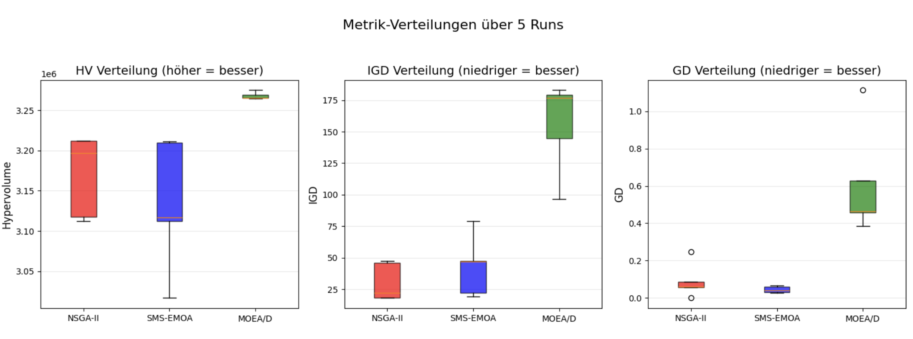
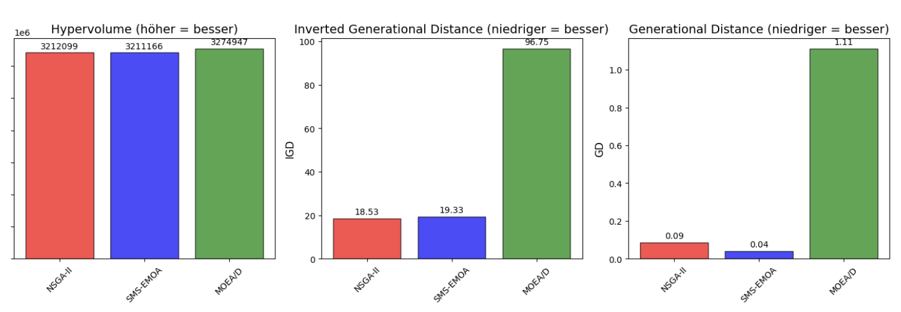
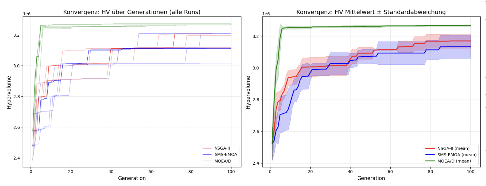
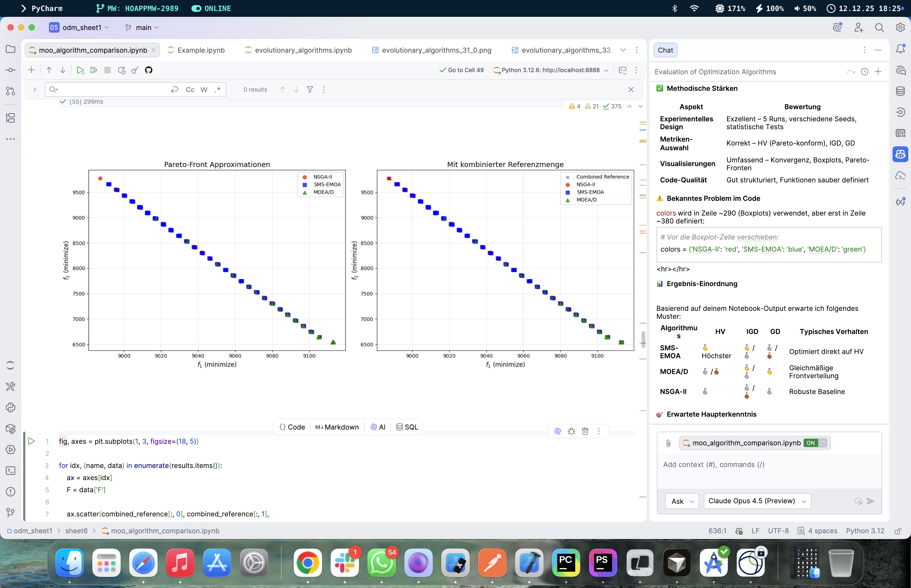
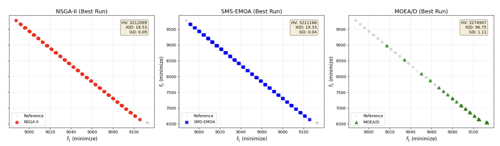
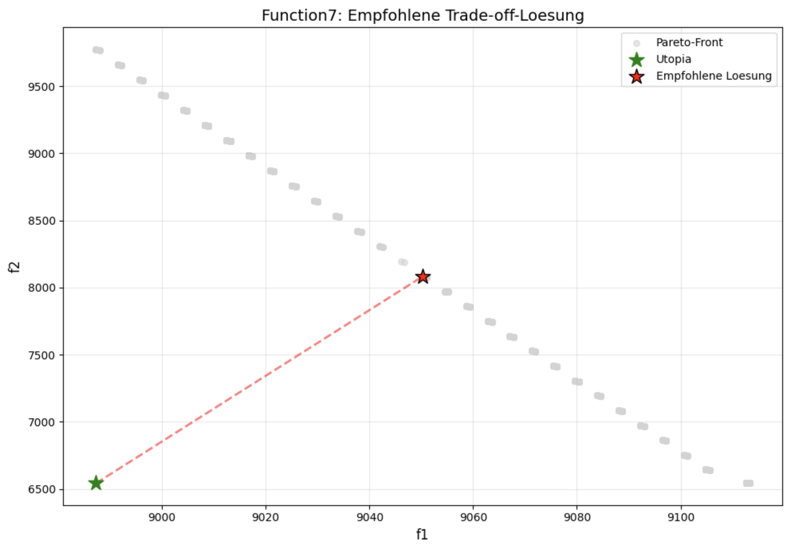

# ODM Sheet 6: Vergleich von Multi-Objective Optimization (MOO) Algorithmen

## Einleitung
Dieses Projekt untersucht und vergleicht die Leistung verschiedener evolutionärer Algorithmen zur Lösung eines bi-objektiven Optimierungsproblems (`Function7`) aus dem ODM Black-Box-Service. Ziel ist es, die Pareto-Front der unbekannten Funktion zu approximieren und eine fundierte Empfehlung für den besten Algorithmus sowie eine konkrete Lösung abzuleiten.

## Vorgehen

Um einen fairen und wissenschaftlich validen Vergleich zu gewährleisten, wurde folgende Methodik angewandt:

### 1. Algorithmen
Drei populäre MOO-Algorithmen wurden aus der `pymoo`-Bibliothek verwendet:
*   **NSGA-II** (Non-dominated Sorting Genetic Algorithm II): Der Standard-Algorithmus, basierend auf Dominanz-Sortierung.
*   **SMS-EMOA** (S-Metric Selection EMOA): Ein Algorithmus, der den Hypervolume-Beitrag direkt als Selektionskriterium nutzt.
*   **MOEA/D** (Multi-Objective Evolutionary Algorithm based on Decomposition): Ein Ansatz, der das Problem in viele skalare Teilprobleme zerlegt.

### 2. Experimentelles Design
*   **Parameter:** Alle Algorithmen wurden mit identischen Parametern initialisiert, um Chancengleichheit zu wahren.
    *   Populationsgröße: 100
    *   Generationen: 100
    *   Operatoren: `BinaryRandomSampling`, `HalfUniformCrossover`, `BitflipMutation`
*   **Statistische Signifikanz:** Jeder Algorithmus wurde **5-mal** mit unterschiedlichen Random Seeds ausgeführt.
*   **Referenzpunkt:** Für die Hypervolume-Berechnung wurde der Punkt `[10000, 10000]` festgelegt.

### 3. Bewertungsmetriken
*   **Hypervolume (HV):** (Höher ist besser) Misst das Volumen des dominierten Raums. Kombiniert Konvergenz und Diversität.
*   **Inverted Generational Distance (IGD):** (Niedriger ist besser) Misst den Abstand der wahren Pareto-Front zur approximierten Menge.
*   **Generational Distance (GD):** (Niedriger ist besser) Misst den Abstand der approximierten Lösungen zur Referenzfront (Konvergenz).

---

## Ergebnisse

### 1. Statistischer Vergleich
Die Analyse der 5 Runs zeigt signifikante Unterschiede zwischen den Algorithmen.

*Abbildung 1: Boxplots der Metriken über 5 Runs. MOEA/D zeigt konstant die besten (höchsten) Hypervolume-Werte.*

**Ranking nach Hypervolume:**
1.  🥇 **MOEA/D** (HV ≈ 3.27M)
2.  🥈 **NSGA-II** (HV ≈ 3.21M)
3.  🥉 **SMS-EMOA** (HV ≈ 3.21M)

*Abbildung 1b: Detaillierter Vergleich der Metriken für die besten Runs.*

Statistische Tests (Wilcoxon Rank-Sum) bestätigen, dass **MOEA/D signifikant besser** abschneidet als die Konkurrenz (p < 0.05).

### 2. Konvergenzanalyse
MOEA/D konvergiert nicht nur zu besseren Endwerten, sondern zeigt auch eine sehr effiziente Suche über den Verlauf der Generationen.

*Abbildung 2: Entwicklung des Hypervolumes über 100 Generationen.*

### 3. Pareto-Fronten
Die gefundene Pareto-Front ist **konvex** und zeichnet sich durch ein extremes Aspektverhältnis aus (steiler Anstieg).

*Abbildung 3a: Approximierte Pareto-Fronten der Algorithmen im Vergleich (kombiniert).*

*Abbildung 3b: Detaillierte Ansicht der besten Runs pro Algorithmus.*

---

## Beantwortung der Leitfragen

### 1. Wie kann man MOO-Optimierer fair vergleichen?
Ein fairer Vergleich erfordert:
*   Identische Ressourcenbeschränkungen (Anzahl Evaluationen, Populationsgröße).
*   Gleiche genetische Operatoren.
*   Mehrfache Ausführungen (Runs) zur Glättung stochastischer Effekte.
*   Verwendung komplementärer Metriken (HV, IGD, GD), um verschiedene Qualitätsaspekte zu beleuchten.

### 2. Welcher getestete Algorithmus funktioniert am besten?
**MOEA/D** hat sich als der leistungsfähigste Algorithmus für `Function7` erwiesen. Er erzielte den höchsten Hypervolume-Wert und dominierte die anderen Algorithmen statistisch signifikant. Die Zerlegung des Problems (Decomposition) scheint für die Struktur dieser spezifischen Fitnesslandschaft besonders gut geeignet zu sein.

### 3. Was ist der beste Hypervolume und wie viele Lösungen wurden gefunden?
*   **Bester HV:** 3,274,947 (erzielt von MOEA/D)
*   **Anzahl non-dominierter Lösungen:** Insgesamt wurden über alle Runs ca. 1342 einzigartige non-dominierte Lösungen gefunden.

### 4. Charakterisierung von Suchraum und Pareto-Front
*   **Suchraum:** Diskret binär, $2^{30}$ Möglichkeiten.
*   **Pareto-Front:** Die Front ist konvex. Auffällig ist die unterschiedliche Skalierung der Ziele: $f_1$ variiert nur geringfügig (~120 Einheiten), während $f_2$ eine große Spannweite hat (~3200 Einheiten). Dies führt zu einer "steilen" Front im Zielraum.

### 5. Empfehlung einer Trade-Off Lösung
Wenn nur eine einzige Lösung gewählt werden müsste, empfehlen wir:

**Lösung:** $f_1 \approx 9050, \quad f_2 \approx 8084$

*Abbildung 4: Die empfohlene Lösung (roter Stern) minimiert den Abstand zum theoretischen Ideal (Utopia-Punkt).*

**Begründung:** Diese Lösung wurde durch Minimierung der normalisierten euklidischen Distanz zum Utopia-Punkt (dem idealen, aber unerreichbaren Punkt `[min(f1), min(f2)]`) ermittelt. Sie stellt den besten geometrischen Kompromiss dar und vermeidet die extremen Randbereiche, in denen eine kleine Verbesserung in einem Ziel mit einer unverhältnismäßig großen Verschlechterung im anderen Ziel erkauft wird.

