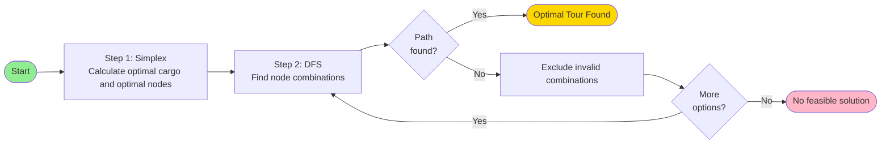

# Optimization and Decision Making

## Exercise Sheet 1 by Tim, Valentin & Simon

---

# Table of contents

<Toc text-sm minDepth="1" maxDepth="2" />

---
title: Idea
---

## Optimal Criteria

We identified 2 potential solutions that can be considered optimal.

**Profit Optimal**
Find solution where the primary goal is maximizing profit and secondarily minimizing travel cost.

**Travel Cost Optimal**
Find solution where the primary goal is minimizing travel cost and secondarily maximizing profit.

We choose to Present the Profit Optimal Solution

- assumption visiting a node → picking up all items there

---

# Flow Chart



---
hideInToc: true
---

# Constraints

## Feasibility

Our solution is only feasible if all constraints are satisfied:

$$56 \leq 2 \cdot \text{gemstone} + 1 \cdot \text{epoxy} + 6 \cdot \text{copper}$$

$$15 \leq \text{gemstone} + \text{epoxy} + \text{copper}$$

$$\text{copper} \leq 2 \cdot \text{gemstone}$$

One can also assume that:

$$\text{gemstone}, \text{epoxy}, \text{copper} \geq 0$$

$$\text{gemstone}, \text{epoxy}, \text{copper} \in \mathbb{Z}$$

---

# Integer Linear Programming

Integer LP works in 3 Steps.

1. First solve LP without the integer constraints
2. Run Branch and Bound on Solution and iteratively add integer / binary constraits to variables
3. Find optimal solution with feasable variables

---

# DFS

We utilize B&B to get to an Solution on average in faster than O(n!) time complexity.

- branch out only to Nodes that are in the ideal solution.
- start depth first search and find a Solution that will lead to proning of branches because of less optimal travel cost
- repeat until optimal solution/solutions are found

---

# Consideration of Solution

## Time complexity

---

# Results

For Profit Optimized Solution

**1. Integer LP (simplex -> Branch and Bound)**

- Optimal Resources: (4,0,8)
- Nodes Included: (E, I, J, L)
- Nodes Possibly Included: (D, F)

**2. B&B**

- Optimal Route (A→,...,→N)

- Profit: 920

- Travel Cost:

<!--
**1. Integer LP (simplex → B&B)**

Optimal Resources: (4,0,8)

Solution 1: {E, I, D, J, L}

Solution 2: {E, I, F, J, L}

**2. B&B**

Optimal Route (A→,...,→N)

Profit: 920

Travel Cost:
-->

# Summary

The algorithm combines three powerful techniques to solve the profit-maximizing tour planning problem:

**ILP** for optimal cargo selection and for node identification
**DFS** for route validation

<div class="pt-12">
    A deterministic, constraint-aware, and optimality-guaranteeing approach
</div>

---
layout: center
class: text-center
---

# Thank You

Questions?

---

# Appendix

```
# Binary indicator variables for each location
var bB binary;  # Location B
var bC binary;  # Location C
var bD binary;  # Location D
var bE binary;  # Location E
var bF binary;  # Location F
var bG binary;  # Location G
var bH binary;  # Location H
var bI binary;  # Location I
var bJ binary;  # Location J
var bK binary;  # Location K
var bL binary;  # Location L
var bM binary;  # Location M

# Total resources collected
var x1 >= 0, integer;  # Total gemstones
var x2 >= 0, integer;  # Total epoxy resin
var x3 >= 0, integer;  # Total copper

# Resource collection from selected locations
subject to gemstone_collection:
    x1 = 0*bB + 1*bC + 1*bD + 1*bE + 1*bF + 1*bG + 4*bH + 2*bI + 0*bJ + 1*bK + 0*bL + 0*bM;

subject to epoxy_collection:
    x2 = 1*bB + 2*bC + 0*bD + 0*bE + 0*bF + 3*bG + 1*bH + 0*bI + 0*bJ + 1*bK + 0*bL + 3*bM;

subject to copper_collection:
    x3 = 1*bB + 0*bC + 0*bD + 2*bE + 0*bF + 2*bG + 0*bH + 1*bI + 3*bJ + 3*bK + 2*bL + 0*bM;

# Maximize profit from collected resources
maximize z:
    30*x1 + 10*x2 + 100*x3;

# Original constraints
subject to weight:
    2*x1 + 1*x2 + 6*x3 <= 56;

subject to capacity:
    x1 + x2 + x3 <= 15;

subject to cogem:
    x3 <= 2*x1;

end;
```
