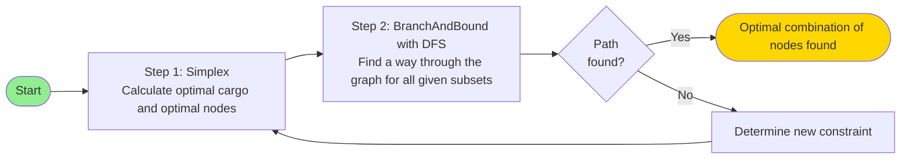

# Optimization and Decision Making

## Exercise Sheet 1 by Tim, Valentin & Simon

---

## Optimal Criteria

We identified 2 potential solutions that can be considered optimal.

1. **Profit Optimal** Find solution where the primary goal is maximizing profit and secondarily minimizing travel cost.

2. **Travel Cost Optimal** Find solution where the primary goal is minimizing travel cost and secondarily maximizing profit.

Assumption visiting a node → pick up all items

<br>

**We choose to Present the Profit Optimal Solution**

---

# Algorithm - Flow Chart

<div class="grid place-items-center h-full">

</div>


---
hideInToc: true
---

# Constraints

### Feasibility

Our solution is only feasible if all constraints are satisfied:

1. 2 $\cdot \text{gemstone} + 1 \cdot \text{epoxy} + 6 \cdot \text{copper} \leq 56$
2. $\text{gemstone} + \text{epoxy} + \text{copper} \leq 15$
3. $\text{copper} \leq 2 \cdot \text{gemstone}$

One can also assume that:

$\text{gemstone}, \text{epoxy}, \text{copper} \in \mathbb{N}_0$

<!--
1. The warehouse can only store 56 tons, 2. The truck can only carry 15 units, 3. We do not want to store more than twice as many units of copper as gemstones. Only natural numbers and 0 is accepted, because we cannot carry half of a copper.
-->

---

## Integer Linear Programming

Integer LP works in 3 steps:

1. First solve LP without the integer constraints
2. Run Branch and Bound on Solution and iteratively add integer / binary constraits to variables
3. Find optimal solution with feasable variables

Use **Indicator** variables for Nodes in Graph as additional constraint for simplex:

- Indicator x = 0 or x = 1
- Gemstones = 0B + 1C + 1D + 1E + 1F + 1G + 4H + 2I + 0J + 0L + 0M

---

# Branch and Bound

1. Receive subsets of nodes that lead to the optimal solution
2. Try to find a way through the subset of the graph for every subset
   - Track the tour costs
   - Choose the tour with lowest cost
   - Use DFS
3. Three possible outcomes:
   1. Only one subset has a connection from A 🠒 N: Finished!
   2. More than one have a connection: Choose the one with the lowest tour costs 🠒 Finished!
   3. No subset has a direct connection: Return to ILP with new constraint

Annotation to 3.3: New constraint is about the value of the goods (e.g. < 920€)

---

# Consideration of Solution

#### Simplex (Profit Maximization)

- Worst-Case Complexity
  - Exponential $O(2^n)$
- Average-Case Complexity
  - Polynomial $O(n^3)$
  - In practice, Simplex is highly efficient
  - Most of the times, average case, when the inputs are slightly randomly perturbed

#### Branch and Bound (Route Finding)

- Worst-Case Complexity
  - Exponential $O(k^n)$
  - When no branches can be pruned
- Average-Case Complexity
  - Still exponential
  - The efficiency is highly dependent on the quality of the "bound"

<!--
Keyword here: Smoothed Analysis
-->

---
layout: two-cols
---

## For Profit Optimized Solution

**1. Integer LP (simplex 🠒 Branch and Bound)**

- Optimal Resources: 4 Gemstones, 0 Epoxy , 8 Copper
- Subsets that support the solution:
  1.  $\{E, I, D, J, L\}$
  2.  $\{E, I, F, J, L\}$

**2. Branch and Bound with DFS**

- Subset that leads through the graph: $\{E, I, F, J, L\}$
  - tour: A 🠒 E 🠒 F 🠒 J 🠒 I 🠒 L 🠒 N
  - value: 920 €
  - costs: $2 + 3 + 1 + 3 + 2 + 1 = 12$

::right::


---
layout: center
class: text-center
hideInToc: true
---

# Thank You

Questions?

---

# Appendix

```
# Binary indicator variables for each location
var bB binary;  # Location B
var bC binary;  # Location C
var bD binary;  # Location D
var bE binary;  # Location E
var bF binary;  # Location F
var bG binary;  # Location G
var bH binary;  # Location H
var bI binary;  # Location I
var bJ binary;  # Location J
var bK binary;  # Location K
var bL binary;  # Location L
var bM binary;  # Location M

# Total resources collected
var x1 >= 0, integer;  # Total gemstones
var x2 >= 0, integer;  # Total epoxy resin
var x3 >= 0, integer;  # Total copper

# Resource collection from selected locations
subject to gemstone_collection:
    x1 = 0*bB + 1*bC + 1*bD + 1*bE + 1*bF + 1*bG + 4*bH + 2*bI + 0*bJ + 1*bK + 0*bL + 0*bM;


```

---

# Appendix

```
subject to epoxy_collection:
    x2 = 1*bB + 2*bC + 0*bD + 0*bE + 0*bF + 3*bG + 1*bH + 0*bI + 0*bJ + 1*bK + 0*bL + 3*bM;


subject to copper_collection:
    x3 = 1*bB + 0*bC + 0*bD + 2*bE + 0*bF + 2*bG + 0*bH + 1*bI + 3*bJ + 3*bK + 2*bL + 0*bM;

# Maximize profit from collected resources
maximize z:
    30*x1 + 10*x2 + 100*x3;

# Original constraints
subject to weight:
    2*x1 + 1*x2 + 6*x3 <= 56;

subject to capacity:
    x1 + x2 + x3 <= 15;

subject to cogem:
    x3 <= 2*x1;

end;
```
