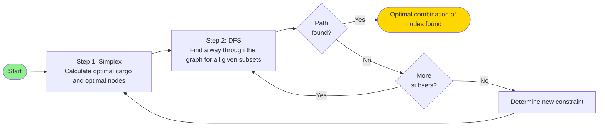

# Optimization and Decision Making

## Exercise Sheet 1 by Tim, Valentin & Simon

---

# Table of contents

<Toc text-sm minDepth="1" maxDepth="2" />

---

## Optimal Criteria

We identified 2 potential solutions that can be considered optimal.

**Profit Optimal**
Find solution where the primary goal is maximizing profit and secondarily minimizing travel cost.

**Travel Cost Optimal**
Find solution where the primary goal is minimizing travel cost and secondarily maximizing profit.

We choose to Present the Profit Optimal Solution

- assumption visiting a node → picking up all items there

---
layout: center
---

# Algorithm - Flow Chart



---
hideInToc: true
---

# Constraints

### Feasibility

Our solution is only feasible if all constraints are satisfied:

$$56 \leq 2 \cdot \text{gemstone} + 1 \cdot \text{epoxy} + 6 \cdot \text{copper}$$

$$15 \leq \text{gemstone} + \text{epoxy} + \text{copper}$$

$$\text{copper} \leq 2 \cdot \text{gemstone}$$

One can also assume that:

$$\text{gemstone}, \text{epoxy}, \text{copper} \geq 0$$

$$\text{gemstone}, \text{epoxy}, \text{copper} \in \mathbb{Z}$$

---

# Integer Linear Programming ?

Integer LP works in 3 Steps.

1. First solve LP without the integer constraints
2. Run Branch and Bound on Solution and iteratively add integer / binary constraits to variables
3. Find optimal solution with feasable variables

---

# Depth First Search

1. Receive subsets of nodes that lead to the determined optimal solution
2. Try to find a way through the graph for every given subset
   - track the tour coasts
3. Three possible outcomes:
   1. Only one subset has a connection from A 🠒 N: Finished!
   2. More than one have a connection: Choose the one with the lowest tour coasts 🠒 Finished!
   3. No subset has a direct connection: Return to ILP with new constraint

Annotation to 3.3: New constraint is about the value of the goods (e.g. < 920€)

---

# Consideration of Solution

#### Simplex (Profit Maximization)

- Worst-Case Complexity
  - Exponential $O(2^n)$
- Average-Case Complexity
  - Polynomial $O(n^3)$
  - In practice, Simplex is highly efficient
  - Most of the times, average case, when the inputs are slightly randomly perturbed

#### DfS (Route Finding)

- Worst-Case Complexity
  - $O(V + E)$
  - $V$ is the number of nodes (Locations) and $E$ is the number of connections (Edges)
- Average-Case Complexity
  - $O(V + E)$
  - The average-case runtime is generally the same as the worst-case

---

## For Profit Optimized Solution

**1. Integer LP (simplex 🠒 Branch and Bound)**

- Optimal Resources: 4 Gemstones, 0 Epoxy , 8 Copper
- Subsets that support the solution:
  1.  \{E, I, D, J, L\}
  2.  \{E, I, F, J, L\}

**2. DFS**

- Subset that leads through the graph: \{E, I, F, J, L\}
  - tour: A 🠒 E 🠒 F 🠒 J 🠒 I 🠒 L 🠒 N
  - value: 920€
  - costs: 2 + 3 + 1 + 3 + 2 + 1 = 12

{ class="w-1/2" }

---
layout: center
class: text-center
hideInToc: true
---

# Thank You

Questions?

---
hideInToc: true
---

# Appendix

```
# Binary indicator variables for each location
var bB binary;  # Location B
var bC binary;  # Location C
var bD binary;  # Location D
var bE binary;  # Location E
var bF binary;  # Location F
var bG binary;  # Location G
var bH binary;  # Location H
var bI binary;  # Location I
var bJ binary;  # Location J
var bK binary;  # Location K
var bL binary;  # Location L
var bM binary;  # Location M

# Total resources collected
var x1 >= 0, integer;  # Total gemstones
var x2 >= 0, integer;  # Total epoxy resin
var x3 >= 0, integer;  # Total copper

# Resource collection from selected locations
subject to gemstone_collection:
    x1 = 0*bB + 1*bC + 1*bD + 1*bE + 1*bF + 1*bG + 4*bH + 2*bI + 0*bJ + 1*bK + 0*bL + 0*bM;

subject to epoxy_collection:
    x2 = 1*bB + 2*bC + 0*bD + 0*bE + 0*bF + 3*bG + 1*bH + 0*bI + 0*bJ + 1*bK + 0*bL + 3*bM;

subject to copper_collection:
    x3 = 1*bB + 0*bC + 0*bD + 2*bE + 0*bF + 2*bG + 0*bH + 1*bI + 3*bJ + 3*bK + 2*bL + 0*bM;

# Maximize profit from collected resources
maximize z:
    30*x1 + 10*x2 + 100*x3;

# Original constraints
subject to weight:
    2*x1 + 1*x2 + 6*x3 <= 56;

subject to capacity:
    x1 + x2 + x3 <= 15;

subject to cogem:
    x3 <= 2*x1;

end;
```
