# Optimization and Decision Making

## Exercise Sheet 1 by Tim, Valentin & Simon

---

# Idea #1

## Optimal Criteria

We identified 2 potential solutions that can be considered optimal.

**Profit Optimal**
Find solution where the primary goal is maximizing profit and secondarily minimizing travel cost.

**Travel Cost Optimal**
Find solution where the primary goal is minimizing travel cost and secondarily maximizing profit.

we choose to Present the Profit Optimal Solution

---

# Idea #2

## Feasibility

Our solution is only feasible if all constraints are satisfied:

$$56 \leq 2 \cdot \text{gemstone} + 1 \cdot \text{epoxy} + 6 \cdot \text{copper}$$

$$15 \leq \text{gemstone} + \text{epoxy} + \text{copper}$$

$$\text{copper} \leq 2 \cdot \text{gemstone}$$

One can also assume that:

$$\text{gemstone}, \text{epoxy}, \text{copper} \geq 0$$

$$\text{gemstone}, \text{epoxy}, \text{copper} \in \mathbb{Z}$$

---

# Table of contents

<Toc text-sm minDepth="1" maxDepth="2" />

---

# Approach

1. Get Optimal Solution for Gemstones via Integer Linear Programming
2. Find Optimal Path in Graph via Branch and Bound

---

# Integer Linear Programming

Integer LP works in 3 Steps.

1. First solve LP without the integer constraints
2. Run Branch and Bound on Solution and iteratively add integer / binary constraits to variables
3. Find optimal solution with feasable variables

```
# Binary indicator variables for each location
var bB binary;  # Location B
var bC binary;  # Location C
var bD binary;  # Location D
var bE binary;  # Location E
var bF binary;  # Location F
var bG binary;  # Location G
var bH binary;  # Location H
var bI binary;  # Location I
var bJ binary;  # Location J
var bK binary;  # Location K
var bL binary;  # Location L
var bM binary;  # Location M

# Total resources collected
var x1 >= 0, integer;  # Total gemstones
var x2 >= 0, integer;  # Total epoxy resin
var x3 >= 0, integer;  # Total copper

# Resource collection from selected locations
subject to gemstone_collection:
    x1 = 0*bB + 1*bC + 1*bD + 1*bE + 1*bF + 1*bG + 4*bH + 2*bI + 0*bJ + 1*bK + 0*bL + 0*bM;

subject to epoxy_collection:
    x2 = 1*bB + 2*bC + 0*bD + 0*bE + 0*bF + 3*bG + 1*bH + 0*bI + 0*bJ + 1*bK + 0*bL + 3*bM;

subject to copper_collection:
    x3 = 1*bB + 0*bC + 0*bD + 2*bE + 0*bF + 2*bG + 0*bH + 1*bI + 3*bJ + 3*bK + 2*bL + 0*bM;

# Maximize profit from collected resources
maximize z:
    30*x1 + 10*x2 + 100*x3;

# Original constraints
subject to weight:
    2*x1 + 1*x2 + 6*x3 <= 56;

subject to capacity:
    x1 + x2 + x3 <= 15;

subject to cogem:
    x3 <= 2*x1;

end;
```

---

# Branch & Bound

- assumption visiting a node → picking up all items there

We utilize B&B to get to an Solution on average in faster than O(n!) timecomplexity.

- branch out only to Nodes that are in the ideal solution.
- start depth first search and find a Solution that will lead to proning of branches because of less optimal travel cost
- repeat until optimal solution/solutions are found

---

# Results

For Profit Optimized Solution

**1. Integer LP (simplex -> Branch and Bound)**

- Optimal Resources: (4,0,8)
- Nodes Included: (E, I, J, L)
- Nodes Possibly Included: (D, F)

**2. B&B**

- Optimal Route (A→,...,→N)

- Profit: 920

- Travel Cost:

<!--
**1. Integer LP (simplex → B&B)**

Optimal Resources: (4,0,8)

Nodes Included: {E, I, J, L}

Nodes Possibly Included: {D,F}

**2. B&B**

Optimal Route (A→,...,→N)

Profit: 920

Travel Cost:
-->

---

# Profit-Maximizing Tour Planning Algorithm

A systematic approach to optimal cargo distribution and route planning

---

# Algorithm Overview

A three-step iterative and deterministic approach

- 🎯 **Step 1: Profit Optimization** - Find the most profitable cargo combination using Simplex & MILP

- 📦 **Step 2: Node Enumeration** - Identify all valid node combinations that deliver the optimal cargo

- 🛣️ **Step 3: Path Validation** - Verify tour feasibility using Depth-First Search

### Goal

Determine which goods to transport, from which nodes, along which path, to maximize profit while respecting all constraints.

---
layout: two-cols
---

# Step 1

## Profit Optimization

**Method:** Simplex Algorithm + Mixed Integer Linear Programming (MILP)

**Objective:** Calculate the optimal cargo combination that yields the highest total profit

**Output:** An optimal goods vector specifying exact quantities of each commodity to transport

::right::

### Constraints Considered

- Maximum total weight (56 tons)
- Maximum transported units (15)
- Copper ≤ 2 × Gems

### Key Question Answered

_"Which goods and in what quantities should be transported?"_

---

# Step 1: Mathematical Foundation

The optimization problem formulated as MILP:

$$
\max \sum_{i=1}^{n} p_i \cdot x_i
$$

Subject to:

$$
\begin{aligned}
\sum_{i=1}^{n} w_i \cdot x_i &\leq 56 \text{ tons} \\
\sum_{i=1}^{n} x_i &\leq 15 \text{ units} \\
x_{copper} &\leq 2 \cdot x_{gems} \\
x_i &\in \mathbb{Z}^+_0 \text{ for all } i
\end{aligned}
$$

<v-click>

Where $p_i$ is profit per unit, $x_i$ is quantity, and $w_i$ is weight per unit

</v-click>

---
layout: two-cols
---

# Step 2

## Enumerated Knapsack

**Method:** Extended knapsack problem with systematic enumeration

**Objective:** Find all node combinations that can deliver the cargo quantities determined in Step 1

**Technique:** Branch-and-bound for efficient search space pruning

::right::

### Validation Criteria

During enumeration, combinations are immediately excluded if they:

- Exceed 15 units or 56 tons
- Don't match the target quantities from Step 1
- Violate business rules (Copper ≤ 2 × Gems)

---

### Branch-and-Bound Strategy

```mermaid {scale: 0.7}
graph TD
    A[All Nodes] --> B[Subset 1]
    A --> C[Subset 2]
    A --> D[Subset 3]
    B --> E[Valid ✓]
    C --> F[Invalid ✗<br/>Exceeds weight]
    D --> G[Invalid ✗<br/>Wrong quantities]
    style E fill:#90EE90
    style F fill:#FFB6C6
    style G fill:#FFB6C6
```



---
layout: two-cols
---

# Step 3

## Path Validation with DFS

**Method:** Depth-First Search with backtracking

**Objective:** Verify that valid node combinations can be connected in an actual tour from start to destination

**Process:** Start at node A, traverse all required nodes, reach destination node N

::right::

### DFS Characteristics

- Explores one path completely before backtracking
- Tests alternative routes if current path fails
- Guarantees finding a path if one exists
- Efficient for this constraint-based search

---

# Step 3: DFS Traversal


### Backtracking Logic

If a path doesn't work, the algorithm:

1. Returns to the last decision point
2. Tries alternative routes
3. Excludes the combination if no path exists
4. Moves to the next node combination from Step 2

---

# Complete Algorithm Logic

1. **MILP Optimization** (Step 1)
   - Calculate most profitable cargo combination
   - Output: Optimal goods vector

2. **Knapsack Enumeration** (Step 2)
   - Find all node subsets matching the goods vector
   - Filter by weight, unit, and business constraints
   - Output: Set of feasible node combinations

3. **DFS Path Finding** (Step 3)
   - Test each node combination for connectivity
   - Verify tour from A to N exists
   - Output: Profit-maximizing feasible tour

### Iteration Strategy

If no combination works, exclude infeasible options and repeat with next-best cargo combination

---

# Algorithm Flow Diagram


---
layout: two-cols
---

# Key Constraints Summary

### Capacity Constraints

- **Maximum Weight:** 56 tons
- **Maximum Units:** 15 units
- Hard limits enforced at every step

::right::

### Business Rules

- **Copper-Gems Ratio:** Copper ≤ 2 × Gems
- Ensures balanced cargo composition
- Validated during enumeration

### Route Constraints

- **Start Node:** Fixed (e.g., Node A)
- **End Node:** Fixed (e.g., Node N)
- **Connectivity:** All selected nodes must be reachable in a single tour

---

# Algorithm Advantages

- ✅ **Optimality Guaranteed** - Finds mathematically optimal solution within constraints

- ✅ **Systematic Approach** - Separates concerns: profit → nodes → path

- ✅ **Efficient Pruning** - Branch-and-bound reduces search space significantly

- ✅ **Constraint Compliance** - All business rules and capacity limits enforced

- ✅ **Deterministic** - Same input always produces same optimal output

- ✅ **Iterative Fallback** - Automatically tries next-best options if needed

---
layout: center
class: text-center
---

# Summary

The algorithm combines three powerful techniques to solve the profit-maximizing tour planning problem:

**MILP** for optimal cargo selection  
**Enumerated Knapsack** for node identification  
**DFS** for route validation

<div class="pt-12">
    A deterministic, constraint-aware, and optimality-guaranteeing approach
</div>

---
layout: center
class: text-center
---

# Thank You

Questions?
