# Profit-Maximizing Tour Planning Algorithm

A systematic approach to optimal cargo distribution and route planning

  
    Press Space for next page <carbon:arrow-right class="inline"/>
  

---
transition: fade-out
---

# Algorithm Overview

A three-step iterative and deterministic approach

<v-clicks>

- 🎯 **Step 1: Profit Optimization** - Find the most profitable cargo combination using Simplex & MILP

- 📦 **Step 2: Node Enumeration** - Identify all valid node combinations that deliver the optimal cargo

- 🛣️ **Step 3: Path Validation** - Verify tour feasibility using Depth-First Search

</v-clicks>

 

<v-click>

### Goal
Determine which goods to transport, from which nodes, along which path, to maximize profit while respecting all constraints.

</v-click>

---
layout: two-cols
---

# Step 1
## Profit Optimization

<v-clicks>

**Method:** Simplex Algorithm + Mixed Integer Linear Programming (MILP)

**Objective:** Calculate the optimal cargo combination that yields the highest total profit

**Output:** An optimal goods vector specifying exact quantities of each commodity to transport

</v-clicks>

::right::

<v-click>

### Constraints Considered

- Maximum total weight (56 tons)
- Maximum transported units (15)
- Copper ≤ 2 × Gems

</v-click>

<v-click>

### Key Question Answered
*"Which goods and in what quantities should be transported?"*

</v-click>

---

# Step 1: Mathematical Foundation

The optimization problem formulated as MILP:

$$
\max \sum_{i=1}^{n} p_i \cdot x_i
$$

Subject to:

$$
\begin{aligned}
\sum_{i=1}^{n} w_i \cdot x_i &\leq 56 \text{ tons} \\
\sum_{i=1}^{n} x_i &\leq 15 \text{ units} \\
x_{copper} &\leq 2 \cdot x_{gems} \\
x_i &\in \mathbb{Z}^+_0 \text{ for all } i
\end{aligned}
$$

<v-click>

Where $p_i$ is profit per unit, $x_i$ is quantity, and $w_i$ is weight per unit

</v-click>

---
layout: two-cols
---

# Step 2
## Enumerated Knapsack

<v-clicks>

**Method:** Extended knapsack problem with systematic enumeration

**Objective:** Find all node combinations that can deliver the cargo quantities determined in Step 1

**Technique:** Branch-and-bound for efficient search space pruning

</v-clicks>

::right::

<v-click>

### Validation Criteria

During enumeration, combinations are immediately excluded if they:

- Exceed 15 units or 56 tons
- Don't match the target quantities from Step 1
- Violate business rules (Copper ≤ 2 × Gems)

</v-click>

---

# Step 2: Enumeration Process

### Example Node Subsets

- {C, E, F}
- {C, H, G}
- {A, D, G, K}
- ...

Each subset is evaluated for feasibility

### Branch-and-Bound Strategy

```mermaid {scale: 0.7}
graph TD
    A[All Nodes] --> B[Subset 1]
    A --> C[Subset 2]
    A --> D[Subset 3]
    B --> E[Valid ✓]
    C --> F[Invalid ✗<br/>Exceeds weight]
    D --> G[Invalid ✗<br/>Wrong quantities]
    style E fill:#90EE90
    style F fill:#FFB6C6
    style G fill:#FFB6C6
```

<v-click>

### Key Question Answered
*"Which node combinations can provide the required goods?"*

</v-click>

---
layout: two-cols
---

# Step 3
## Path Validation with DFS

<v-clicks>

**Method:** Depth-First Search with backtracking

**Objective:** Verify that valid node combinations can be connected in an actual tour from start to destination

**Process:** Start at node A, traverse all required nodes, reach destination node N

</v-clicks>

::right::

<v-click>

### DFS Characteristics

- Explores one path completely before backtracking
- Tests alternative routes if current path fails
- Guarantees finding a path if one exists
- Efficient for this constraint-based search

</v-click>

---

# Step 3: DFS Traversal

<v-click>

### Backtracking Logic

If a path doesn't work, the algorithm:
1. Returns to the last decision point
2. Tries alternative routes
3. Excludes the combination if no path exists
4. Moves to the next node combination from Step 2

</v-click>

---

# Complete Algorithm Logic

<v-clicks depth="2">

1. **MILP Optimization** (Step 1)
   - Calculate most profitable cargo combination
   - Output: Optimal goods vector

2. **Knapsack Enumeration** (Step 2)
   - Find all node subsets matching the goods vector
   - Filter by weight, unit, and business constraints
   - Output: Set of feasible node combinations

3. **DFS Path Finding** (Step 3)
   - Test each node combination for connectivity
   - Verify tour from A to N exists
   - Output: Profit-maximizing feasible tour

</v-clicks>

<v-click>

### Iteration Strategy
If no combination works, exclude infeasible options and repeat with next-best cargo combination

</v-click>

---

# Algorithm Flow Diagram

---

# Key Constraints Summary

### Capacity Constraints

- **Maximum Weight:** 56 tons
- **Maximum Units:** 15 units
- Hard limits enforced at every step

### Business Rules

- **Copper-Gems Ratio:** Copper ≤ 2 × Gems
- Ensures balanced cargo composition
- Validated during enumeration

<v-click>

### Route Constraints

- **Start Node:** Fixed (e.g., Node A)
- **End Node:** Fixed (e.g., Node N)
- **Connectivity:** All selected nodes must be reachable in a single tour

</v-click>

---

# Algorithm Advantages

<v-clicks>

- ✅ **Optimality Guaranteed** - Finds mathematically optimal solution within constraints

- ✅ **Systematic Approach** - Separates concerns: profit → nodes → path

- ✅ **Efficient Pruning** - Branch-and-bound reduces search space significantly

- ✅ **Constraint Compliance** - All business rules and capacity limits enforced

- ✅ **Deterministic** - Same input always produces same optimal output

- ✅ **Iterative Fallback** - Automatically tries next-best options if needed

</v-clicks>

---
layout: center
class: text-center
---

# Summary

The algorithm combines three powerful techniques to solve the profit-maximizing tour planning problem:

**MILP** for optimal cargo selection  
**Enumerated Knapsack** for node identification  
**DFS** for route validation

  
    A deterministic, constraint-aware, and optimality-guaranteeing approach
  

---
layout: center
class: text-center
---

# Thank You

Questions?

  Powered by Slidev

